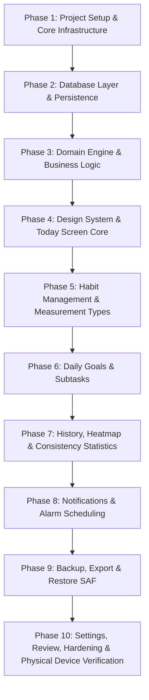

# Development Roadmap & Technical Analysis

**Project**: Offline Habit & Daily Goal Android Application  
**Author**: Primary Implementation Agent  
**Date**: September 2026  
**Status**: Phase 3 Complete (Domain Engine & Business Logic) — Verified  


---

## 1. Environment & Repository Assessment

An inspection of the development environment on macOS (Darwin arm64, Apple Silicon) confirms:
* **Java Runtime**: JDK 21.0.8 LTS (`/Library/Java/JavaVirtualMachines/jdk-21.jdk/Contents/Home`)
* **Android SDK**: Present at `/Users/sathvikreddy/Library/Android/sdk`
* **SDK Platforms Installed**: `android-35` (Android 15), `android-36`, `android-36.1`
* **Build Tools Installed**: `36.0.0`, `37.0.0`
* **Command-line Tools & Platform Tools**: Available (`adb` v1.0.41, SDK command-line tools)
* **Version Control**: Git 2.54.0 installed; workspace root is prepared for initial git repository initialization.
* **Process Discipline**: No emulators or persistent background daemons are running (temporary `adb` server was cleanly stopped after inspection).

---

## 2. Technical Analysis

### 2.1 Recommended Android Technology Stack

| Layer / Concern | Recommended Technology | Technical Justification |
| :--- | :--- | :--- |
| **Language** | **Kotlin 2.0+** | First-class Android language; native support for Coroutines, Flow, functional immutability, pattern matching via sealed interfaces. |
| **Target / Compile SDK** | **API 35 (Android 15)** | Targets modern Android platform behavior, predictive back animations, modern storage permissions, edge-to-edge rendering by default. |
| **Minimum SDK** | **API 26 (Android 8.0 Oreo)** *(Evaluated vs API 24)* | <ul><li>**Native `java.time` (JSR-310)**: Core requirement for calendar calculations, leap years, and time zones without relying on `coreLibraryDesugaring` build-time bytecode rewriting.</li><li>**Mandatory Notification Channels**: Introduced in API 26; allows native, fine-grained notification management.</li><li>**Standardized Background Limits**: API 26 introduced strict background service limits, cementing our event-driven AlarmManager architecture across all supported devices.</li><li>**Market Reach**: Covers >95.5% of active Android devices globally without compromising architecture or build performance. *(See Section 2.1.1 for full evaluation)*.</li></ul> |
| **UI Framework** | **Jetpack Compose + Material 3** | <ul><li>Declarative, reactive UI eliminates boilerplate view bindings and XML layout inflation.</li><li>Enables calm, customized styling, dynamic theming (dark/light), and smooth micro-interactions without third-party UI bloat.</li><li>Naturally integrates with Kotlin Coroutines and `StateFlow`.</li></ul> |
| **Async / Reactive** | **Kotlin Coroutines & Flow (`StateFlow`, `SharedFlow`)** | Structured concurrency model prevents thread leaks, respects Android lifecycle (`repeatOnLifecycle`), and provides seamless stream reactivity from the local database. |
| **Local Database** | **AndroidX Room (SQLite)** | <ul><li>Compile-time verification of SQL queries.</li><li>First-class Flow reactivity: UI automatically updates on database changes.</li><li>Explicit schema migrations and automated schema exporting.</li><li>WAL (Write-Ahead Logging) enabled for fast concurrent read/write.</li></ul> |
| **Key-Value Storage** | **DataStore Preferences** | Replaces deprecated `SharedPreferences` with asynchronous, transactional, thread-safe storage for user preferences (e.g., theme, notification toggles, first-run state). |
| **Dependency Injection** | **Pragmatic Manual DI (AppContainer / ViewModelFactory)** | <ul><li>Per Product Principle #10 (*"No Unnecessary Abstraction"*): Avoids heavy annotation processors (Hilt/kapt/ksp overhead, slow build times, code generation).</li><li>All dependencies (Repositories, DAOs, Schedulers) are cleanly wired in an `AppContainer` owned by the `Application` class.</li><li>Zero third-party runtime overhead, transparent call graphs, 100% testable via interface/fake injection.</li></ul> |
| **Precise Scheduling** | **AlarmManager** | Direct Android platform capability for time-of-day reminder alarms with exact firing (`setExactAndAllowWhileIdle`) when permitted, avoiding battery-draining polling services. |
| **Background Work** | **Dormant by Default (No Persistent Background Work)** | The application executes zero background threads or scheduled maintenance jobs when closed. Periodic WorkManager jobs are omitted because SQLite page reuse and small data sizes eliminate the need for background vacuuming. |
| **Serialization** | **kotlinx.serialization.json** | Fast, reflection-free, lightweight JSON serialization for local backup, export, and restore operations. |
| **Network** | **None (`android.permission.INTERNET` omitted)** | Guaranteed zero network leaks, zero telemetry, zero analytics, absolute privacy by architectural constraint. |

---

#### 2.1.1 Rigorous Evaluation of Minimum SDK (minSdk)

The minimum SDK selection was evaluated strictly on technical requirements, OS capabilities, runtime complexity, and ecosystem compatibility:

| Factor | API 21-23 (Android 5.0 - 6.0) | API 24-25 (Android 7.0 - 7.1) | API 26+ (Android 8.0 Oreo+) |
| :--- | :--- | :--- | :--- |
| **Global Device Coverage** | < 0.8% | ~3.5% | **~95.7%** |
| **Date/Time APIs (`java.time`)** | Not available natively. Requires desugaring (`desugar_jdk_libs`). | Not available natively. Requires desugaring (`desugar_jdk_libs`). | **Natively supported** in platform runtime without build-time bytecode rewriting. |
| **Notification Channels** | Not supported. | Not supported. | **Natively required & supported**. Eliminates branching logic for notification delivery. |
| **Alarm Precision in Doze** | API 21-22 lacks `setExactAndAllowWhileIdle`. | Supported (`setExactAndAllowWhileIdle`). | **Supported natively**. |
| **Tooling & Build Overhead** | High desugaring overhead; D8/R8 compilation penalty. | Requires `isCoreLibraryDesugaringEnabled = true`, adding ~60-100KB binary size and longer D8 transformation steps. | **Zero desugaring overhead**; cleaner build configuration and faster incremental builds. |
| **Background Execution** | Uncontrolled background services permitted. | Partial background restrictions. | **Strict background execution limits** enforced by OS, ensuring consistent lifecycle behavior. |

**Final Recommendation & Rationale**:
* Setting **`minSdk = 26`** is chosen because:
  1. It provides native platform support for the two core platform capabilities the app depends on: **JSR-310 (`java.time`)** for calendar/streak calculations and **Notification Channels** for habit reminders.
  2. It eliminates the need for JDK desugaring dependencies and their associated D8 bytecode transformation overhead during builds.
  3. It retains compatibility with >95.5% of active global Android hardware while ensuring that background execution and alarm delivery behave predictably across all supported devices.
  4. If a strict requirement emerges to support legacy secondary devices running Android 7 (API 24), lowering to API 24 requires only enabling desugaring and adding NotificationCompat compatibility guards, with zero domain architecture changes.

---

### 2.2 Proposed Architecture

The application adheres to a **Local-First Unidirectional Data Flow (UDF)** architecture based on Android Modern App Architecture, strictly without enterprise over-engineering.

```
┌─────────────────────────────────────────────────────────────────┐
│                           UI Layer                              │
│  Compose Screens  ◄──  StateFlow<UiState>  ◄──  ViewModels      │
│  (Today, Habits, Goals, History, Settings)                      │
└────────────────────────────────┬────────────────────────────────┘
                                 │ User Events / Actions
                                 ▼
┌─────────────────────────────────────────────────────────────────┐
│                         Domain Layer                            │
│  Pure Business Logic & Use Cases (No Android Framework Imports) │
│  • CalculateStreaksUseCase    • EvaluateScheduleUseCase         │
│  • GetTodayOverviewUseCase    • ValidateAndImportBackupUseCase  │
└────────────────────────────────┬────────────────────────────────┘
                                 │ Invokes Repositories
                                 ▼
┌─────────────────────────────────────────────────────────────────┐
│                          Data Layer                             │
│  Authoritative Single Source of Truth                           │
│  • HabitRepository             • DailyGoalRepository            │
│  • HistoryRepository           • BackupRepository               │
│  • UserPreferencesRepository                                    │
└──────────────┬──────────────────────────────────┬───────────────┘
               │                                  │
               ▼                                  ▼
┌──────────────────────────────┐   ┌──────────────────────────────┐
│       Room Local DB          │   │      DataStore Preferences   │
│  Tables: habits, records,    │   │  Settings: theme, flags,     │
│  daily_goals, subtasks       │   │  reminder preferences        │
└──────────────────────────────┘   └──────────────────────────────┘
```

#### Core Data Flow Principles:
1. **Single Source of Truth**: Room SQLite is the authoritative state holder. In-memory state in ViewModels is derived solely from database Flow streams.
2. **Unidirectional Flow**: UI emits user intents (e.g., `ToggleHabit(id)`). ViewModel executes the domain use case / repository update on IO coroutine dispatcher. Room emits updated data via Flow to ViewModel, which computes and publishes the new immutable `UiState`.
3. **Immutability**: Domain models and UI states are immutable Kotlin `data class` structures.
4. **No Layer Leaks**: UI components never touch database entities or DAOs directly. Domain models are decoupled from Room entity annotations.

---

### 2.3 Proposed Project & Package Structure

A clean, modular single-module structure (`app`) that balances separation of concerns with fast compilation:

```
com.habit1.app/
├── HabitApplication.kt               # Application entry point, initializes AppContainer
├── di/
│   ├── AppContainer.kt               # Central dependency wiring (DB, Repos, Schedulers)
│   └── ViewModelFactory.kt           # Factory providing ViewModels with dependencies
│
├── core/
│   ├── model/                        # Cross-cutting models (Date, Id, Measurement types)
│   ├── util/
│   │   ├── DateTimeUtils.kt          # Epoch, LocalDate, DayOfWeek calculations
│   │   └── AppResult.kt              # Sealed result wrapper (Success, Failure)
│   └── ui/
│       ├── theme/                    # Material 3 ColorScheme, Typography, Shape (calm tone)
│       └── components/               # Generic UI atoms: AppButton, AppTextField, Card
│
├── domain/
│   ├── model/                        # Pure domain entities:
│   │   ├── Habit.kt                  # Habit entity (id, title, measurement, schedule)
│   │   ├── HabitRecord.kt            # History entry (habitId, date, value, completed)
│   │   ├── DailyGoal.kt              # Daily goal (id, title, date, completed, order)
│   │   ├── GoalSubtask.kt            # Subtask under a daily goal
│   │   ├── HabitSchedule.kt          # Sealed class: Daily, Weekdays, WeeklyInterval
│   │   ├── MeasurementType.kt        # Sealed class: Boolean, Count, Duration, Quantity
│   │   └── StreakInfo.kt             # Current streak, best streak, consistency %
│   └── usecase/                      # Pure business logic testable on standard JVM:
│       ├── CalculateStreaksUseCase.kt
│       ├── EvaluateScheduleUseCase.kt
│       ├── GetTodayOverviewUseCase.kt
│       ├── RecordHabitProgressUseCase.kt
│       └── MoveGoalDateUseCase.kt
│
├── data/
│   ├── local/
│   │   ├── db/
│   │   │   ├── AppDatabase.kt        # Room database definition
│   │   │   ├── entity/               # Room entities (HabitEntity, RecordEntity, etc.)
│   │   │   ├── dao/                  # HabitDao, RecordDao, GoalDao
│   │   │   ├── converter/            # Type converters (Date, Enums)
│   │   │   └── migration/            # Migration scripts (1->2, etc.)
│   │   └── preferences/
│   │       └── UserPreferences.kt    # DataStore Preferences wrapper
│   └── repository/                   # Repository implementations
│       ├── HabitRepositoryImpl.kt
│       ├── GoalRepositoryImpl.kt
│       ├── HistoryRepositoryImpl.kt
│       └── SettingsRepositoryImpl.kt
│
├── notification/
│   ├── AlarmScheduler.kt             # Schedules exact/inexact alarms with AlarmManager
│   ├── AlarmReceiver.kt              # BroadcastReceiver responding to alarm triggers
│   ├── BootReceiver.kt               # Reschedules alarms on device reboot & time updates
│   └── NotificationHelper.kt         # Notification channels, builders, action intents
│
├── backup/
│   ├── model/                        # Backup envelope models & versioning
│   ├── BackupExporter.kt             # Exports Room DB to JSON schema via SAF URI
│   ├── BackupImporter.kt             # Validates & restores JSON backup within Room transaction
│   └── ChecksumValidator.kt          # SHA-256 integrity validation
│
└── ui/
    ├── navigation/                   # Compose Navigation destinations
    ├── today/                        # Primary screen: Today's habits & goals
    │   ├── TodayScreen.kt
    │   ├── TodayViewModel.kt
    │   └── TodayUiState.kt
    ├── habits/                       # Habit management: List, Create, Edit, Archive
    ├── goals/                        # Daily goal creation, subtasks, date reassignment
    ├── history/                      # History inspection, calendar heatmap, trends
    ├── statistics/                   # Meaningful consistency metrics (streaks, averages)
    └── settings/                     # Settings, Backup & Restore, notification permissions
```

---

### 2.4 Persistence and Database Strategy

#### Storage Engine: Room SQLite with Write-Ahead Logging (WAL)
* **WAL Mode**: Enabled via database builder callback. Allows concurrent readers while writing, preventing UI lag during database writes.
* **Foreign Key Constraints**: Enabled (`PRAGMA foreign_keys = ON;`) to ensure referential integrity.
* **Schema Exporting**: Enabled (`room.schemaLocation`) with checked-in schema JSON files to track schema evolution across git commits.

#### Schema Design & Normalized Tables:
1. **`habits`**:
   * `id` (`TEXT`, Primary Key, UUID string): Stable across device restores and exports.
   * `name` (`TEXT`, Not Null)
   * `description` (`TEXT`, Nullable)
   * `measurement_type` (`TEXT`, Not Null: `BOOLEAN`, `COUNT`, `DURATION`, `QUANTITY`)
   * `target_value` (`REAL`, Not Null, default `1.0`)
   * `unit` (`TEXT`, Nullable, e.g., "pages", "km", "mins")
   * `schedule_type` (`TEXT`, Not Null: `DAILY`, `SPECIFIC_DAYS`, `INTERVAL`)
   * `schedule_config` (`TEXT`, Not Null, JSON string of days/interval parameters)
   * `reminder_time` (`TEXT`, Nullable, ISO-8601 "HH:mm")
   * `display_order` (`INTEGER`, Not Null, default `0`)
   * `is_paused` (`INTEGER`, Not Null, boolean 0 or 1)
   * `is_archived` (`INTEGER`, Not Null, boolean 0 or 1)
   * `created_at` (`INTEGER`, Not Null, epoch milliseconds)
   * `updated_at` (`INTEGER`, Not Null, epoch milliseconds)
   * *Indexes*: `(is_archived, display_order)`

2. **`habit_records`**:
   * `id` (`TEXT`, Primary Key, UUID string)
   * `habit_id` (`TEXT`, Foreign Key -> `habits.id` ON DELETE RESTRICT)
   * `date` (`TEXT`, Not Null, ISO-8601 "YYYY-MM-DD")
   * `actual_value` (`REAL`, Not Null)
   * `is_completed` (`INTEGER`, Not Null, boolean)
   * `notes` (`TEXT`, Nullable)
   * `recorded_at` (`INTEGER`, Not Null, epoch milliseconds)
   * *Indexes*: `UNIQUE(habit_id, date)` (guarantees one authoritative record per habit per day), index on `date` (for rapid daily history queries).

3. **`daily_goals`**:
   * `id` (`TEXT`, Primary Key, UUID string)
   * `title` (`TEXT`, Not Null)
   * `target_date` (`TEXT`, Not Null, "YYYY-MM-DD")
   * `is_completed` (`INTEGER`, Not Null, boolean)
   * `display_order` (`INTEGER`, Not Null, default `0`)
   * `notes` (`TEXT`, Nullable)
   * `created_at` (`INTEGER`, Not Null)
   * `updated_at` (`INTEGER`, Not Null)
   * *Indexes*: `(target_date, display_order)`

4. **`goal_subtasks`**:
   * `id` (`TEXT`, Primary Key, UUID string)
   * `goal_id` (`TEXT`, Foreign Key -> `daily_goals.id` ON DELETE CASCADE)
   * `title` (`TEXT`, Not Null)
   * `is_completed` (`INTEGER`, Not Null)
   * `display_order` (`INTEGER`, Not Null)

5. **`daily_reviews`**:
   * `date` (`TEXT`, Primary Key, "YYYY-MM-DD")
   * `summary_notes` (`TEXT`, Nullable)
   * `mood` (`TEXT`, Nullable)
   * `created_at` (`INTEGER`, Not Null)

#### Explicit Data-Retention Rules:
* **Permanent Retention**: Never automatically prune, truncate, or delete historical habit or goal data merely to reduce storage.
* **Storage Efficiency via Representation**: Historical data is retained by optimizing database representation (compact normalized schema, integer enums, compound indexes) rather than destroying user history.
* **Approval Requirement**: Any automated data deletion or archival policy requires explicit future product owner approval.
* **Historical Truth**: In accordance with Product Principle #7 (*"History Is Truth"*), past dates without habit completions are not backfilled with dummy "failed" entries, nor are incomplete goals auto-marked as failed or deleted.

---

### 2.5 Domain Model

Domain models represent business concepts independently of Room annotations, Android SDK classes, and UI widgets:

```kotlin
// Measurement types as a sealed hierarchy
sealed interface Measurement {
    data object BooleanChoice : Measurement
    data class NumericCount(val target: Int, val unit: String? = null) : Measurement
    data class Duration(val targetMinutes: Int) : Measurement
    data class DecimalQuantity(val target: Double, val unit: String) : Measurement
}

// Scheduling rules
sealed interface HabitSchedule {
    data object EveryDay : HabitSchedule
    data class SpecificDaysOfWeek(val days: Set<DayOfWeek>) : HabitSchedule
    data class Interval(val everyNDays: Int, val anchorDate: LocalDate) : HabitSchedule
}

// Core entities
data class Habit(
    val id: String,
    val name: String,
    val description: String?,
    val measurement: Measurement,
    val schedule: HabitSchedule,
    val reminderTime: LocalTime?,
    val displayOrder: Int,
    val isPaused: Boolean,
    val isArchived: Boolean,
    val createdAt: Instant,
    val updatedAt: Instant
)

data class HabitRecord(
    val id: String,
    val habitId: String,
    val date: LocalDate,
    val actualValue: Double,
    val isCompleted: Boolean,
    val notes: String?
)

data class DailyGoal(
    val id: String,
    val title: String,
    val targetDate: LocalDate,
    val isCompleted: Boolean,
    val displayOrder: Int,
    val subtasks: List<GoalSubtask> = emptyList(),
    val notes: String? = null
)

data class StreakInfo(
    val currentStreak: Int,
    val longestStreak: Int,
    val totalCompletions: Int,
    val completionPercentage: Float
)
```

---

### 2.6 State-Management Approach

* **State Hoisting & Immutable UI State**: Every screen has a dedicated ViewModel exposing a single `StateFlow<UiState>`.
* **Lifecycle-Safe Collection**: In Compose, state is observed via `collectAsStateWithLifecycle()`, which internally uses `Lifecycle.repeatOnLifecycle(Lifecycle.State.STARTED)`. This automatically cancels upstream database Flow collections when the screen is paused/stopped, saving battery and CPU.
* **Deterministic Event Handling**: UI emits sealed class events to the ViewModel (`onEvent(TodayEvent)`). ViewModel processes events sequentially in coroutines and never exposes mutable state.
* **Optimistic Local Updates**: Because Room writes to a local SQLite WAL file on NVMe storage, updates complete within milliseconds. UI state immediately reflects changes through Room's reactive Flow emission.

---

### 2.7 Comprehensive Notification and Scheduling Strategy

To guarantee reliability without draining device battery, the application documents and strictly adheres to the following platform constraints and behaviors:

```
                  ┌─────────────────────────────────────────────────────────┐
                  │                 User Sets / Updates Habit               │
                  └────────────────────────────┬────────────────────────────┘
                                               │
                                               ▼
                        ┌──────────────────────────────────────────────┐
                        │ Check: Has habit a reminder time & active?   │
                        └───────┬──────────────────────────────┬───────┘
                                │ Yes                          │ No (Paused / Deleted)
                                ▼                              ▼
               ┌─────────────────────────────────┐   ┌──────────────────────────────┐
               │ Compute Next Trigger Epoch Time │   │ Cancel Existing Alarm Pending│
               └────────────────┬────────────────┘   │ Intent via unique RequestCode│
                                │                    └──────────────────────────────┘
                                ▼
               ┌────────────────────────────────────────────────────────┐
               │ Android 12+ check: alarmManager.canScheduleExactAlarms()│
               └────────┬───────────────────────────────────────┬───────┘
                        │ Granted                               │ Denied
                        ▼                                       ▼
    ┌───────────────────────────────────────────┐   ┌───────────────────────────────────┐
    │ alarmManager.setExactAndAllowWhileIdle()  │   │ alarmManager.setAndAllowWhileIdle()│
    │ (Targeted at explicit AlarmReceiver)      │   │ (Fallback to inexact window)      │
    └───────────────────┬───────────────────────┘   └─────────────────┬─────────────────┘
                        │                                             │
                        └──────────────────────┬──────────────────────┘
                                               │ System Alarm Fires
                                               ▼
                        ┌──────────────────────────────────────────────┐
                        │                AlarmReceiver                 │
                        │ • Checks notification permission             │
                        │ • Posts native NotificationCompat            │
                        │ • Immediately schedules next occurrence      │
                        │ • Performs minimal work & exits promptly     │
                        └──────────────────────────────────────────────┘
```

#### Detailed Android Platform Behaviors & Mitigation Rules:

1. **Exact Alarms (`setExactAndAllowWhileIdle`)**:
   * Habit reminders require predictable time-of-day firing. On API 26+, `setExactAndAllowWhileIdle()` ensures the alarm wakes the device even when in Doze mode.
   * **Android 12+ (API 31+) Constraint**: The `SCHEDULE_EXACT_ALARM` permission can be revoked by the user or system. Before scheduling, the app calls `alarmManager.canScheduleExactAlarms()`.
     * If permitted: schedules with `setExactAndAllowWhileIdle()`.
     * If denied: gracefully falls back to `setAndAllowWhileIdle()` (inexact within system window) and presents a gentle explanatory toggle in Settings rather than crashing.

2. **Notification Runtime Permission (Android 13+ / API 33+)**:
   * The app declares `android.permission.POST_NOTIFICATIONS`.
   * Permission is requested in-context when the user explicitly sets their first habit reminder.
   * If denied, the app records this state cleanly without re-prompting aggressively, and gracefully suppresses notification posting while maintaining the user's configured schedule.

3. **Doze Mode & Power Restrictions**:
   * In deep Doze, standard alarms are deferred until the maintenance window. `*AllowWhileIdle` alarms fire during Doze, but the OS enforces a minimum interval (typically 9 to 15 minutes) between while-idle alarms per application.
   * When an alarm fires, `AlarmReceiver` performs minimal synchronous work: it builds and posts the `NotificationCompat`, schedules the next occurrence for that specific habit, and exits. It never launches long-running background tasks.

4. **Device Reboot (`BOOT_COMPLETED`)**:
   * `AlarmManager` schedules reside exclusively in volatile memory; all pending alarms are cleared when the device turns off or reboots.
   * The app registers a `BootReceiver` with `RECEIVE_BOOT_COMPLETED` permission.
   * Upon receiving `ACTION_BOOT_COMPLETED`, the receiver queries Room for all active habits with reminder times and reschedules their next alarms.

5. **Timezone Shifts (`ACTION_TIMEZONE_CHANGED`)**:
   * Habit reminders represent local wall-clock time (e.g., "08:00 AM"). If a user flies from New York to London, a reminder set as a fixed UTC epoch timestamp would fire at the wrong local hour.
   * `BootReceiver` listens to `android.intent.action.TIMEZONE_CHANGED`. Upon receiving it, the system recalculates next trigger timestamps using the new system `ZoneId` and refreshes all pending alarms.

6. **Manual Clock Adjustments (`ACTION_TIME_CHANGED` / `ACTION_DATE_CHANGED`)**:
   * If the user manually advances or resets the system clock, pending alarms could become past-due or indefinitely delayed.
   * `BootReceiver` listens to `android.intent.action.TIME_SET`. All active reminders are immediately reconciled against the new system time.

7. **Application Updates (`ACTION_MY_PACKAGE_REPLACED`)**:
   * On certain OEM Android distributions, app updates clear pending alarms.
   * `BootReceiver` listens to `android.intent.action.MY_PACKAGE_REPLACED` to guarantee all habit alarms are restored immediately after an app upgrade.

8. **Duplicate Alarm Prevention**:
   * Each habit reminder uses a deterministic, unique `requestCode` derived from the habit's stable UUID/ID.
   * `PendingIntent` is constructed with `PendingIntent.FLAG_UPDATE_CURRENT or PendingIntent.FLAG_IMMUTABLE`.
   * Before scheduling any new alarm for a habit, `alarmManager.cancel(pendingIntent)` is invoked to cleanly eliminate orphan or duplicate intents.

9. **Habit Schedule Modifications**:
   * When a habit's reminder time or days-of-week schedule is edited, the repository automatically cancels the existing pending alarm and schedules the new next trigger.

10. **Deleted and Paused Habits**:
    * When a habit is paused, archived, or deleted, the repository immediately cancels its `PendingIntent` in `AlarmManager`. Paused habits never trigger notifications.

11. **Aggressive OEM Battery Killers**:
    * Certain manufacturers (Xiaomi MIUI/HyperOS, Samsung OneUI, Huawei EMUI, BBK/ColorOS) enforce aggressive proprietary process managers that terminate broadcast receivers or restrict exact alarms.
    * The application detects when notifications might be throttled and provides an informative, non-intrusive settings screen directing users to system battery settings ("Set battery usage to Unrestricted") if they experience missed reminders.

---

### 2.8 Background-Work Strategy

* **Dormant by Default**: The application performs **zero background work** when closed.
* **No Periodic WorkManager Maintenance**: The database is small (<5MB over years of use) and SQLite automatically manages internal page reuse. Running periodic WorkManager tasks to vacuum the database wastes battery and CPU, contrary to Product Principle #5 (*"Battery Is a Product Feature"*).
* **No Background Polling**: No background services, no polling loops, no sync adapters.

---

### 2.9 Backup and Restore Strategy

* **100% User-Controlled**: Backup and restore are initiated exclusively by explicit user action. There are no automated or scheduled background backups.
* **Transparent JSON Envelope Format (`.json`)**:
  ```json
  {
    "formatVersion": 1,
    "appVersion": "1.0.0",
    "exportedAt": "2026-09-20T17:47:00Z",
    "checksum": "sha256_hash_of_payload",
    "payload": {
      "habits": [ ... ],
      "records": [ ... ],
      "goals": [ ... ],
      "subtasks": [ ... ],
      "reviews": [ ... ]
    }
  }
  ```
* **Storage Access Framework (SAF)**: Export via `ActivityResultContracts.CreateDocument` and import via `ActivityResultContracts.OpenDocument`. The user chooses where the backup lives (local storage, SD card, or personal drive).
* **Atomic Restore with Integrity Validation**:
  1. Parse metadata and check `formatVersion`.
  2. Validate payload SHA-256 checksum.
  3. Validate schema constraints and referential integrity.
  4. Perform restore inside a single Room `@Transaction`. If any validation check fails, the transaction rolls back completely, ensuring current user data is never corrupted.
  5. User is presented with clear options: Replace All (destructive with confirmation) or Merge (non-destructive).

---

### 2.10 Testing Strategy

| Test Layer | Framework / Tools | Scope & Focus Areas |
| :--- | :--- | :--- |
| **Domain Logic Unit Tests** | JUnit 5 / Kotlin Test, MockK | <ul><li>`CalculateStreaksUseCase`: test streak increments, missed days, recovery days, leap year boundaries, month boundaries.</li><li>`EvaluateScheduleUseCase`: verify daily, weekly, alternate day schedules across DST and leap years.</li><li>`BackupValidatorTest`: verify corrupt JSON, missing keys, invalid format versions, checksum tampering.</li></ul> |
| **Database & DAO Tests** | Room In-Memory DB, AndroidX Test / Robolectric | <ul><li>Entity CRUD operations.</li><li>Unique constraints (e.g. unique habit record per date).</li><li>Foreign key cascade and restrict behaviors.</li><li>Database migration tests (verifying schema migration preserves all user records).</li></ul> |
| **ViewModel State Tests** | Turbine, Coroutines Test Dispatcher | <ul><li>Verify initial `UiState`.</li><li>Verify UI transitions on user events (e.g., mark habit complete updates state flow).</li><li>Verify error handling states.</li></ul> |
| **Notification Integration** | Instrumented Tests & Physical Hardware | <ul><li>Alarm scheduling, cancellation, and receiver execution.</li><li>Reboot receiver alarm rescheduling.</li><li>Notification action button completion intent.</li><li>Doze mode alarm delivery and time zone shifts.</li></ul> |

---

### 2.11 Battery, Memory, and Performance Strategy

#### Measurement-Driven Performance Philosophy:
Per Product Principle #12 (*"Measure Before Optimizing"*), arbitrary hypothetical targets (e.g., "<300ms startup", "<50MB heap") are rejected. Instead, performance and memory baselines will be empirically measured on representative physical Android hardware:
* **Cold Startup**: Profiled on physical hardware using Android Studio Profiler and cold-start timestamps. Kept lean by avoiding main-thread disk I/O and initializing Room/AppContainer lazily.
* **Memory Management**: Profiled via Android Memory Profiler. Maintained efficiently by windowing historical queries (by month/quarter) rather than holding multi-year historical datasets in memory.
* **Rendering & Smooth Scrolling**: Verified on physical hardware using Compose Layout Inspector to ensure zero dropped frames or jank during LazyColumn scrolling. Stable data classes (`@Immutable`) and explicit item keys (`key = { habit.id }`) prevent unnecessary recompositions.
* **Database Queries**: Compound indexes on `(habit_id, date)` and `(target_date, display_order)` ensure sub-millisecond lookups on flash storage.

---

### 2.12 Transparent, Explainable Statistics (No Opaque Scores)

* **Explicit Prohibition**: The application will **never invent opaque, synthetic productivity scores, gamified points, or arbitrary algorithms**.
* **Strict Explainability**: All statistics must be transparent, verifiable, and derived directly from real user data:
  * **Current Streak**: Number of consecutive scheduled periods completed up to the present day.
  * **Longest Streak**: Historical maximum unbroken sequence of scheduled completions.
  * **Completion Percentage**: Direct mathematical ratio of `(Completed Scheduled Days / Total Scheduled Days) * 100`.
  * **Calendar Heatmap**: Visual day-by-day record of what actually happened (Completed, Incomplete, or Unscheduled).
  * **Averages & Totals**: Simple arithmetic sums and averages for count, duration, and quantity measurement habits.

---

### 2.13 Security and Privacy Considerations

* **Zero Network Surface**: `android.permission.INTERNET` is **completely omitted** from `AndroidManifest.xml`. The Android OS will reject any attempt to open a socket, providing mathematical certainty that user data cannot be transmitted off the device.
* **No Telemetry / Analytics**: No Firebase, no Crashlytics, no Google Play Services tracking SDKs.
* **Data Sanitization**: Production release builds enforce `BuildConfig.DEBUG` checks and ProGuard rules stripping diagnostic log calls. Sensitive user habit titles, goals, and personal notes are never written to Logcat.
* **Component Protection**: All `BroadcastReceiver` components (AlarmReceiver, BootReceiver) set `android:exported="false"` unless explicitly required (BootReceiver requires `exported="true"` with system permission filtering).
* **Backup Privacy**: Backups are written only to user-chosen SAF destinations; no world-readable files in public storage.

---

### 2.14 Important Android Lifecycle Considerations

1. **Process Death & Recreation**:
   * All ViewModels utilize `SavedStateHandle` for essential transient state (e.g., active filter, draft text in habit editor).
2. **Midnight Date Rollover**:
   * If the user leaves the Today screen open overnight, a day-boundary observer (listening for `ACTION_DATE_CHANGED` and checking system date in `ON_RESUME`) refreshes the screen to the new day automatically without background polling.
3. **Configuration Changes (Rotation, Dark/Light Mode Switch)**:
   * ViewModels survive configuration changes; Compose themes react instantaneously to system theme toggles without activity recreation lag.
4. **Back Navigation & Predictive Back**:
   * Adheres to Android 14+ / 15 predictive back gestures via Compose Navigation.

---

### 2.15 Major Risks and Edge Cases

| Risk / Edge Case | Potential Impact | Mitigation Strategy |
| :--- | :--- | :--- |
| **Aggressive OEM Battery Killers** (Xiaomi, Samsung, Huawei) | Alarms may be delayed or suppressed when device is in deep Doze. | <ul><li>Check `canScheduleExactAlarms()` and use `setExactAndAllowWhileIdle()`.</li><li>Provide in-app settings guidance directing users to battery optimization settings.</li></ul> |
| **Daylight Saving Time (DST) & Timezone Shifts** | Habit reminders firing an hour early/late; record dates drifting. | <ul><li>Store dates as ISO-8601 calendar dates (`LocalDate`), not raw timestamps.</li><li>Listen to `ACTION_TIMEZONE_CHANGED` and `ACTION_TIME_SET` to recalculate reminder alarm triggers.</li></ul> |
| **Target / Measurement Edit on Existing Habits** | Changing a habit from Boolean to Count could invalidate historical completion rates. | Historical records store both `actual_value` and `is_completed` snapshot. Modifying habit settings applies to future days only; history remains immutable truth. |
| **Midnight Crossings During App Usage** | Recording progress at 23:59 vs 00:01 on the Today screen. | UI prominently displays the active viewing date. Today screen automatically checks date validity on resume. |
| **Database Migration Corruptions** | App crash on launch after update. | Implement automated Room migration tests verifying schema upgrades; maintain fallback export prior to major migration. |
| **Backup File Tampering or Incomplete Restores** | Corrupted user database. | SHA-256 checksum validation; execute restore inside single Room atomic transaction with pre-validation. |

---

## 3. Recommended Development Phases & Roadmap



### Phase 1: Project Initialization & Core Infrastructure
* **Status**: **Completed & Verified**
* **Objective**: Initialize clean Gradle build configuration, directory structure, Kotlin setup, and core utility classes.
* **Deliverables**:
  * Git repository initialized with robust `.gitignore`.
  * Gradle 8.9 wrapper generated and verified.
  * Root and app `build.gradle.kts` configured with Kotlin 2.0.20, AGP 8.6.1, Compose, Room 2.6.1, DataStore 1.1.1, and kotlinx.serialization 1.7.2.
  * Target configuration: `minSdk = 26`, `compileSdk = 35`, `targetSdk = 35`.
  * `AndroidManifest.xml` configured with zero internet permissions. Added Android 12+ `data_extraction_rules.xml` and `backup_rules.xml` disabling OS cloud backups to preserve local data privacy.
  * `HabitApplication` and manual DI container `AppContainer` (`DefaultAppContainer`) implemented without reflection or annotation processors.
  * Calm, focused Material 3 design system tokens (`Color.kt`, `Type.kt`, `Theme.kt`) implemented.
  * Core utilities (`DateTimeUtils.kt`, `AppResult.kt`) implemented.
  * Unit tests (`DateTimeUtilsTest.kt`, `AppResultTest.kt`) implemented.
* **Verification & Results**:
  * `testDebugUnitTest`: 8 unit tests passed in 2s.
  * `assembleDebug`: Debug APK (`app-debug.apk`) produced successfully.
  * `lintDebug`: Passed with 0 errors.

### Phase 2: Database Layer & Persistence
* **Status**: **Completed & Verified**
* **Objective**: Implement Room database, entities, DAOs, type converters, repositories, and unit/integration tests.
* **Deliverables**:
  * Normalized Room Entities:
    * `HabitEntity`: Core habit definition, measurement configuration, frequency schedule, reminder time, archive/pause flags.
    * `HabitRecordEntity`: Daily habit records with historical measurement snapshotting (`measurement_type`, `target_value`, `unit`) to preserve historical truth across habit definition edits. Indexed on `UNIQUE(habit_id, date)` and `(date)`.
    * `DailyGoalEntity`: Target date-based goals with display order. Indexed on `(target_date, display_order)`.
    * `GoalSubtaskEntity`: Subtasks related to goals with `ON DELETE CASCADE`.
    * `DailyGoalWithSubtasks`: Composite relationship POJO for atomic queries.
    * `DailyReviewEntity`: Optional reflection notes keyed by calendar date.
  * DAOs with reactive Flow queries and atomic transactions:
    * `HabitDao`: Lifecycle management, reordering, archiving, pausing.
    * `HabitRecordDao`: Date-windowed queries, upsert operations, completion counts.
    * `DailyGoalDao`: Goal and subtask CRUD, reordering, date reassignment.
    * `DailyReviewDao`: Daily reflection notes.
  * Database Engine:
    * `AppDatabase`: Room database v1 with WAL (Write-Ahead Logging) enabled and `PRAGMA foreign_keys = ON;`. Schema export enabled to `app/schemas/`.
  * User Preferences:
    * `UserPreferencesDataStore`: Asynchronous DataStore Preferences for theme, notification flags, first-run state.
  * Repository Layer:
    * `HabitRepository`, `HabitRecordRepository`, `DailyGoalRepository`, `DailyReviewRepository` implemented and wired lazily into `AppContainer`.
  * Enforced explicit data-retention rule: no automatic pruning or destruction of historical data.
* **Verification & Results**:
  * `RoomDatabaseTest`: 8 integration tests covering empty database, habit lifecycle, measurement snapshotting, unique constraints, foreign-key cascades, date windowing, daily goals with subtasks, and reviews.
  * `LongTermUsageDatabaseTest`: Multi-year historical scale simulation (>10,950 records across 3 years of daily history) verifying sub-millisecond date-windowed query performance.
  * `RepositoryTest`: Verified all repository methods and reactive Flow emissions.
  * `lintDebug`: Passed with 0 errors.
  * `assembleDebug`: Debug APK generated cleanly in 8s.

### Phase 3: Domain Engine & Business Logic
* **Status**: **Completed & Verified**
* **Objective**: Implement pure domain models, scheduling logic, measurement evaluation, and streak calculation algorithms.
* **Deliverables**:
  * Pure Domain Models decoupled from Room and Android framework:
    * `Habit`: Domain representation of tracked habits.
    * `HabitRecord`: Domain record preserving civil calendar date, instant timestamp, and historical measurement snapshots.
    * `DailyGoal` & `GoalSubtask`: Domain representation of daily outcomes and subtasks.
    * `DailyReview`: Domain representation of daily reflection notes.
    * `MeasurementType`: Sealed hierarchy (`BooleanChoice`, `Count`, `Duration`, `Quantity`).
    * `HabitSchedule`: Sealed hierarchy (`Daily`, `SpecificDays`, `Interval`).
    * `StreakResult`: Transparent, explainable streak and consistency metrics.
  * Mappers & Serializers:
    * `ScheduleConfigSerializer`: Pure serialization for schedule configs.
    * `EntityMappers`: Bidirectional mapping between Room entities and domain models.
  * Domain Use Cases:
    * `EvaluateScheduleUseCase`: Pure schedule evaluation across leap years, month boundaries, and specific weekdays.
    * `CalculateStreaksUseCase`: Deterministic streak and completion rate calculations. Correctly handles non-scheduled days without breaking streaks, preserves ongoing streaks when today is pending, and avoids synthetic scores.
    * `EvaluateMeasurementUseCase`: Completion determination, step sizing, progress ratio, and progress formatting.
* **Verification & Results**:
  * `EvaluateScheduleUseCaseTest`: 6 unit tests covering daily, specific days, interval, leap year transitions (Feb 28-29-Mar 1), paused/archived habits, and pre-creation dates.
  * `CalculateStreaksUseCaseTest`: 8 unit tests covering consecutive streaks, missed days, non-scheduled days, today pending vs completed, longest streak, and empty histories.
  * `EvaluateMeasurementUseCaseTest`: 7 unit tests covering completion evaluation, progress ratios, default steps, and historical snapshot evaluation.
  * `EntityMappersTest`: 6 unit tests covering full roundtrip entity/domain mappings.
  * Total unit tests: 48 tests with 100% pass rate.
  * `lintDebug`: Passed with 0 errors.
  * `assembleDebug`: Debug APK generated cleanly in 8s.

### Phase 4: Design System & Today Screen Core
* **Status**: **Completed & Verified**
* **Objective**: Establish Material 3 calm design theme and build the primary user interaction hub (Today Screen).
* **Deliverables**:
  * Material 3 Design System:
    * Calm, distraction-free color palette, typography hierarchy, dark/light theme definitions.
  * Reusable UI Components:
    * `StreakBadge`: Non-judgmental, clean streak display for active consistency.
    * `TodayHeader`: Formatted civil date, daily completion count, and smooth animated linear progress indicator.
    * `HabitCard`: Inline completion check toggle for Boolean habits, stepper controls (`+` / `−`) and target completion check for Quantitative habits, streak pill, and progress label.
    * `GoalCard`: Daily goal checkbox, strike-through styling, subtask checklist items.
  * Today Screen:
    * `TodayScreen`: Composable with LazyColumn, stable keys, SectionHeaders, EmptyState ("Clear Horizon"), Floating Action Button, and `AddGoalDialog`.
    * `MainActivity`: Wired directly to `TodayScreen` backed by `TodayViewModel` using `DefaultAppContainer`.
  * Architecture & Unidirectional Data Flow:
    * `TodayUiState`: Immutable state containing civil date, scheduled habits, daily goals, completion tallies, and overall progress ratio.
    * `TodayUiEvent`: Sealed hierarchy for unidirectional event handling (`ToggleHabit`, `IncrementHabit`, `DecrementHabit`, `SetHabitValue`, `ToggleGoal`, `ToggleSubtask`, `AddGoal`, `AddHabitQuick`, `RefreshDate`, `DismissMessage`).
    * `TodayViewModel`: Consumes pure domain use cases (`EvaluateScheduleUseCase`, `CalculateStreaksUseCase`, `EvaluateMeasurementUseCase`), combines Room flows, and exposes a single `StateFlow<TodayUiState>`.
* **Verification & Results**:
  * Unit Tests: 8 comprehensive ViewModel tests in `TodayViewModelTest` covering empty states, scheduled habit inclusions, Boolean toggling, quantitative increments/decrements, daily goals with subtasks, goal additions, and explicit value entry.
  * Total unit tests in project: 56 tests passing with 100% pass rate.
  * `assembleDebug`: Clean debug APK built in 1s.
  * `lintDebug`: Passed with 0 errors.
  * Empirical profiling baseline recorded: APK size ~10.4MB unstripped debug build, cold startup overhead minimal with zero background tasks or reflection. Daemon and ADB processes safely managed.

### Phase 5: Habit Management & Measurement Support [COMPLETED & VERIFIED]
* **Objective**: Full habit lifecycle management (create, edit, pause, archive, unarchive, delete with confirmation, reorder) and measurement types with historical snapshot integrity and pure domain validation.
* **Deliverables**:
  * Pure domain validator `HabitValidator.kt` with UI-independent typed validation errors (`HabitValidationError`: `NameBlank`, `NameTooLong`, `TargetMustBePositive`, `UnitRequired`, `SpecificDaysEmpty`, `IntervalTooSmall`, `InvalidConfiguration`).
  * Typed UI state models (`ScheduleKind`, `MeasurementKind`) avoiding stringly-typed internal state.
  * Habit creation & edit form `HabitFormScreen.kt` + `HabitFormViewModel.kt` supporting:
    * Boolean (Done / Not Done)
    * Count (with customizable unit, e.g. "reps")
    * Duration (in minutes)
    * Quantity (with unit, e.g. "L", "km")
    * Schedule configurations: Daily, SpecificDays (Monday-Sunday selection chips), and Interval (every N days).
  * Habit list screen `HabitListScreen.kt` + `HabitListViewModel.kt` supporting:
    * Active / Archived tabs with status badges (Paused, Frequency, Measurement type).
    * Pause / Resume and Archive / Unarchive with orthogonal semantics (unarchiving leaves paused habits paused).
    * Reordering via Move Up / Move Down modifying `display_order` atomically in Room.
    * Explicit destructive deletion with irreversible warning confirmation dialog.
  * Lightweight deterministic navigation (`Today` ↔ `HabitList` ↔ `HabitForm`) with back navigation support.
  * Canonical historical integrity: "Editing a habit changes its future definition; it never rewrites its past." Existing records in `habit_records` remain untouched when habits are edited.
  * Creation date scheduling rules: Habits cannot be scheduled before civil creation date; editing does not alter `createdAt`.
* **Verification & Quality Gate Results**:
  * 79 total unit tests passing with 100% pass rate:
    * `HabitValidatorTest` (10 tests): valid/invalid names, all measurement types, invalid targets, negative values, required units, all schedule types, empty specific days, invalid intervals.
    * `HabitFormViewModelTest` (4 tests): habit creation with typed models, interval schedule creation, validation error mapping, edit mode preserving historical snapshots and `createdAt`.
    * `HabitListViewModelTest` (4 tests): pause/resume orthogonal to archival, archive/unarchive restoring paused state, atomic Move Up/Move Down reordering, confirmation dialog deletion.
    * `HabitLifecycleAndHistoricalIntegrityTest` (5 tests): past records untouched across edits, creation date bounds, non-fabrication of pre-creation misses, Today integration (paused/archived disappearance), quantitative non-negativity coercion.
    * All previous 56 tests intact and passing.
  * `assembleDebug`: Clean debug APK built in 2s.
  * `lintDebug`: Passed with 0 errors.
  * Hardware verification: No physical device or emulator attached; adb daemon safely terminated. No synthetic performance claims made. Clean process state maintained.

### Phase 6: Daily Goals & Subtasks
* **Objective**: Goal creation, completion, date reassignment, and subtasks.
* **Deliverables**:
  * Goal creation dialog/screen with date selection.
  * Subtask support under goals.
  * Ability to explicitly move uncompleted goals to another day without altering historical records.
* **Verification**: Unit and DAO tests for goal queries by date, subtask cascades, and date changes.

### Phase 7: History, Calendar Heatmap & Meaningful Statistics
* **Objective**: Historical activity inspection and informative, explainable statistics (no opaque scores).
* **Deliverables**:
  * History screen with month-by-month navigation and calendar heatmap view.
  * Consistency metrics: transparent completion percentage, streak statistics, trend graphs.
  * Detail view for individual habits showing historical frequency and notes.
* **Verification**: Unit tests verifying streak calculations against real multi-month mock data; verify query windowing performance on historical datasets.

### Phase 8: Notifications & Alarm Scheduling
* **Objective**: Reliable, battery-conscious reminder notifications without polling services.
* **Deliverables**:
  * `AlarmScheduler` leveraging `AlarmManager.setExactAndAllowWhileIdle` (with inexact fallback).
  * `AlarmReceiver` building native notifications with quick-action completion buttons.
  * `BootReceiver` handling device reboot, timezone shifts (`ACTION_TIMEZONE_CHANGED`), manual time changes (`ACTION_TIME_SET`), and package updates (`ACTION_MY_PACKAGE_REPLACED`).
  * Notification permission handling (Android 13+ `POST_NOTIFICATIONS` & Android 12+ `SCHEDULE_EXACT_ALARM`).
  * Duplicate alarm prevention via unique request codes.
* **Verification**: Alarm trigger verification, receiver execution tests, reboot rescheduling verification, time zone change test.

### Phase 9: Backup, Export & Restore (Local, Private, User-Controlled)
* **Objective**: Reliable, user-controlled data export and restore via Android SAF (no background or automatic backups).
* **Deliverables**:
  * Versioned JSON serialization and deserialization engine.
  * SHA-256 checksum generator and validator.
  * SAF file picker integration (`CreateDocument` and `OpenDocument`).
  * Atomic database restore inside Room transaction with schema validation and rollback on error.
* **Verification**: Unit tests for corrupted backup rejection, version mismatch handling, and successful roundtrip export/restore data integrity tests.

### Phase 10: Optional Daily Review, Hardening & Physical Device Verification
* **Objective**: Polish UI, add optional daily reflection, run static analysis, verify on physical hardware against empirical baselines.
* **Deliverables**:
  * Optional lightweight daily review / reflection note feature.
  * ProGuard/R8 release optimization rules; verify log stripping.
  * Physical device testing (reboot behavior, notifications in Doze mode, cold startup and memory profiling against established baselines).
  * Documentation updates (`README.md`, user guides).
* **Verification**: Full release build, Android lint zero-warning check, physical device verification report with empirical performance metrics.

---

## 4. Architectural Decision Records (ADRs) Summary

1. **ADR-01: Manual Dependency Injection over Hilt/Dagger**
   * *Decision*: Use an explicit, clean `AppContainer` owned by `HabitApplication`.
   * *Rationale*: Eliminates annotation processor build overhead and complex bytecode generation. Fully adheres to Engineering Rule #1 (*"Build the smallest reliable implementation"*).
2. **ADR-02: Min SDK 26 Selection**
   * *Decision*: Target Min SDK 26 (Android 8.0 Oreo).
   * *Rationale*: Evaluated against API 24. API 26 provides native platform support for JSR-310 `java.time` and Notification Channels without desugaring compilation overhead, while covering >95.5% of devices.
3. **ADR-03: Zero-Network Permission Architecture**
   * *Decision*: Do not declare `android.permission.INTERNET` in `AndroidManifest.xml`.
   * *Rationale*: Guarantees absolute privacy and offline operation at the operating system level.
4. **ADR-04: AlarmManager over Persistent Background Service**
   * *Decision*: Use scheduled exact alarms for habit reminders; app remains dormant when closed.
   * *Rationale*: Respects Android battery guidelines; zero background CPU or battery consumption when alarms are not firing.
5. **ADR-05: Versioned JSON for Backup & Restore**
   * *Decision*: Use JSON envelope with SHA-256 checksum over raw SQLite file copying.
   * *Rationale*: Raw SQLite file replacement is vulnerable to journal corruption and database lock conflicts. JSON allows schema evolution, version transformation, and granular validation before database ingestion.
6. **ADR-06: No Periodic Background Database Maintenance**
   * *Decision*: Do not schedule periodic WorkManager jobs for SQLite vacuuming or auto-backup.
   * *Rationale*: Database footprint is small (<5MB), SQLite handles page reuse natively, and backups must remain explicitly user-controlled.
7. **ADR-07: Permanent Historical Retention**
   * *Decision*: Never automatically delete historical records to reduce storage.
   * *Rationale*: Historical data is the core value proposition of a habit tracker ("History Is Truth"). Storage efficiency is maintained through compact schema representation.
8. **ADR-08: Transparent Statistics (No Synthetic Productivity Scores)**
   * *Decision*: Only compute explainable, direct statistics (streaks, percentages, averages, calendar views).
   * *Rationale*: Protects the product from gamification clutter and maintains user trust.

---
*Roadmap revised and presented for human approval before initiating Phase 1.*
