# Habit1

> **Privacy-first, local-first habit tracking and daily goal execution for Android, built around historical truth, personal data ownership, and transparent analytics.**

-3DDC84?logo=android&logoColor=white)
-34A853)

-4285F4?logo=jetpackcompose&logoColor=white)
-FFA000?logo=sqlite&logoColor=white)

-red)


---

## Quick Start

```bash
# 1. Clone the repository
git clone https://github.com/sathvikreddy369/habit.git
cd habit

# 2. Run automated test suite (325 verified unit tests)
./gradlew testDebugUnitTest

# 3. Build release APK (1.71 MB, R8 minified)
./gradlew assembleRelease

# 4. Install onto a connected Android device (API 26+)
adb install -r apks/Habit1-latest-release.apk
```

---

## Table of Contents

1. [Overview & Philosophy](#1-overview-philosophy)
2. [Screenshot Showcase](#2-screenshot-showcase)
3. [Key Features](#3-key-features)
4. [Tech Stack](#4-tech-stack)
5. [Architecture & Key Engineering Decisions](#5-architecture-key-engineering-decisions)
6. [Project Structure](#6-project-structure)
7. [Architecture & Data Flow Diagrams](#7-architecture-data-flow-diagrams)
8. [Data Model & Database Schema](#8-data-model-database-schema)
9. [Data Processing Lifecycle](#9-data-processing-lifecycle)
10. [The Historical Truth Model](#10-the-historical-truth-model)
11. [Analytics Pipeline & Mathematical Formulations](#11-analytics-pipeline-mathematical-formulations)
12. [Privacy & Data Ownership](#12-privacy-data-ownership)
13. [Security & Platform Model](#13-security-platform-model)
14. [Backup, Restore & Integrity Subsystem](#14-backup-restore-integrity-subsystem)
15. [Performance & Empirical Metrics](#15-performance-empirical-metrics)
16. [Testing Suite](#16-testing-suite)
17. [Action Semantics: Pause vs Archive vs Delete](#17-action-semantics-pause-vs-archive-vs-delete)
18. [Build Requirements & Detailed Setup](#18-build-requirements-detailed-setup)
19. [Practical User Guide](#19-practical-user-guide)
20. [Release Management & Artifacts](#20-release-management-artifacts)
21. [Versioning & Changelog](#21-versioning-changelog)
22. [Design & UX Philosophy](#22-design-ux-philosophy)
23. [Accessibility Considerations](#23-accessibility-considerations)
24. [Error Handling & Resilience](#24-error-handling-resilience)
25. [Permissions Breakdown](#25-permissions-breakdown)
26. [Troubleshooting Guide](#26-troubleshooting-guide)
27. [Frequently Asked Questions (FAQ)](#27-frequently-asked-questions-faq)
28. [Current Limitations](#28-current-limitations)
29. [Roadmap](#29-roadmap)
30. [Contributing & Standards](#30-contributing-standards)
31. [Documentation Map](#31-documentation-map)
32. [License & Acknowledgements](#32-license-acknowledgements)
33. [TL;DR](#33-tldr)

---

## 1. Overview & Philosophy

Habit1 is an offline habit tracker and daily goal execution application for Android. It operates under a strict principle: **user data belongs on the user's device**.

The application has no backend servers, requires no accounts, includes no analytical or crash tracking libraries, displays no ads, and **completely omits `android.permission.INTERNET` from its manifest**. It cannot open a network socket or transmit data off the device.

### Core Distinctions

Habit1 separates long-term behavioral consistency from daily task completion:

1. **Habits (Long-Term Behaviors)**: Recurring actions maintained over extended time horizons (e.g., daily reading, workout duration, hydration count, meditation). Evaluated across schedules and historical streaks.
2. **Daily Goals (Concrete Daily Outcomes)**: Explicit tasks targeted for a specific calendar date (e.g., *"Submit project proposal"*, *"Finish DSA Assignment"*), optionally broken into subtasks, supported by time-of-day reminders, and shiftable across days.
3. **Daily Reflection (Subjective Qualitative Check-in)**: An optional daily reflection note and mood snapshot keyed to a calendar date. Strictly decoupled from streaks, completion metrics, and gamified scores.

---

## 2. Screenshot Showcase

All screenshots below represent the application running on physical Android hardware.

| Today Screen | Habits Overview | History (Month Heatmap) |
| :---: | :---: | :---: |
| 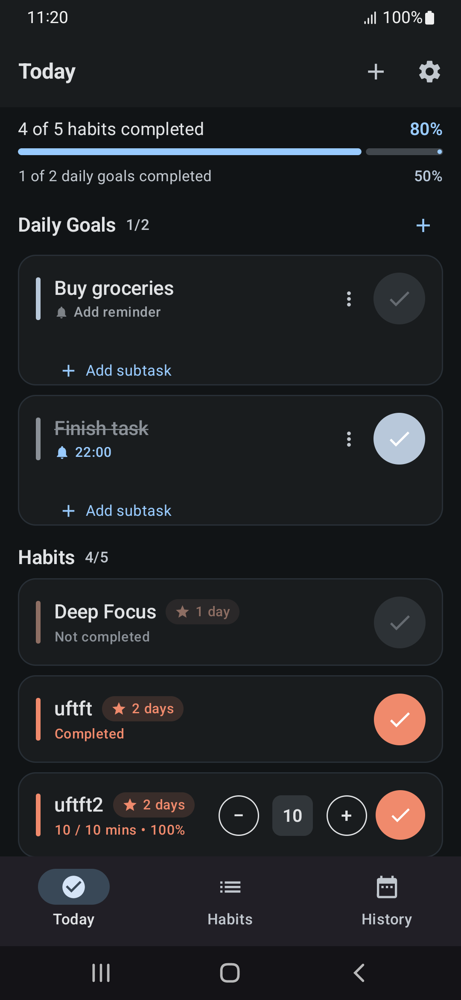 | 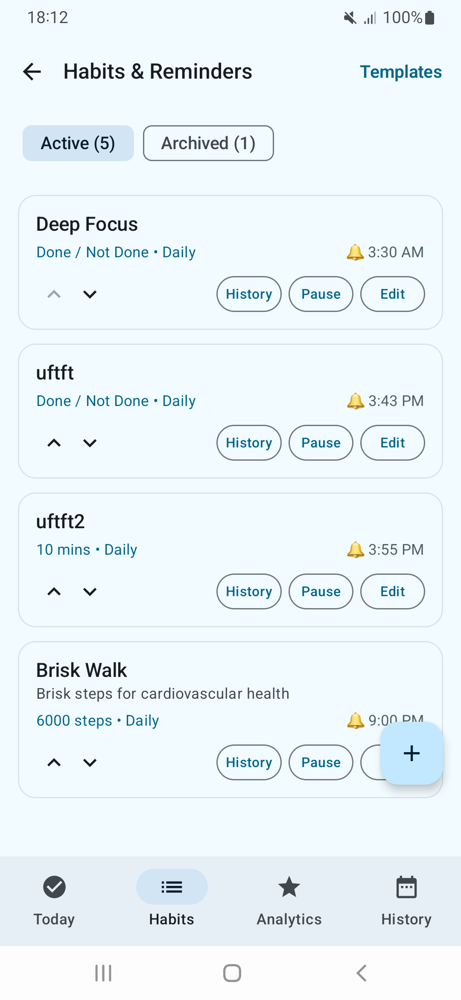 |  |

| Habit Deep Dive | Edit Habit & Schedule | History (Year Matrix) |
| :---: | :---: | :---: |
| 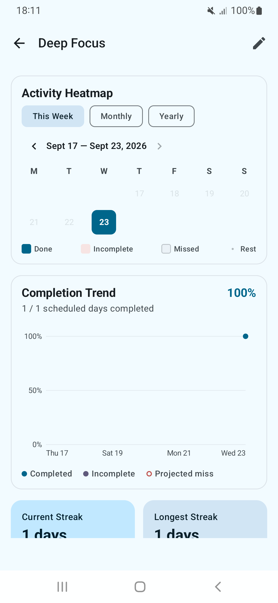 | 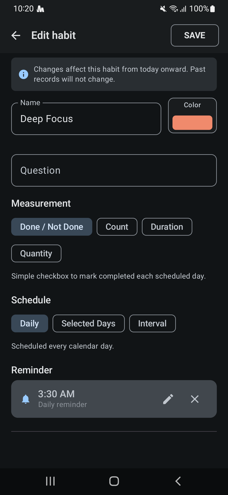 | 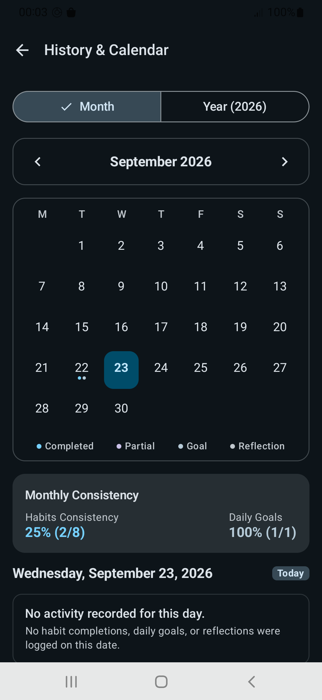 |

| Global Analytics | Settings & Data Management |
| :---: | :---: |
| 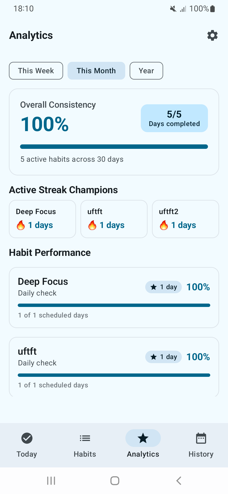 | 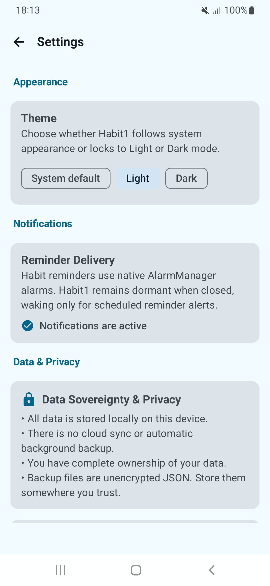 |

---

## 3. Key Features

### Habit Management & Measurement Engine
* **Four Measurement Models**:
  * `BOOLEAN`: Binary completion (Done / Not Done).
  * `COUNT`: Integer counters with interactive stepper controls (`+` / `-`).
  * `DURATION`: Time-based tracking in minutes (e.g., 30 min focus).
  * `QUANTITY`: Decimal values with custom unit descriptors (e.g., 2.5 km running, 3.0 L water).
* **Flexible Scheduling Engine**:
  * **Daily**: Scheduled every day of the week.
  * **Specific Days**: Select days of the week (e.g., Monday, Wednesday, Friday).
  * **Intervals**: Repeated every $N$ days, anchored to an explicit calendar date.
* **Habit Customization & State Control**:
  * Custom accent color palette with contrast-checked indicators.
  * **Pause**: Temporarily halts future scheduling without breaking historical streak continuity.
  * **Archive**: Hides inactive habits from active tracking while fully preserving historical logs.
  * **Delete**: Removes habit and cascades deletion to associated records.
  * **Reorder**: Drag-and-drop or explicit display ordering.
  * **Habit Templates**: Pre-configured habit templates for rapid setup.

### Daily Tracking (Today Dashboard)
* **Unified Workspace**: Habits, daily goals, subtasks, and optional daily reflection on a single view.
* **Action-First Check Buttons**: Circular action controls with visual distinction between completed and uncompleted states.
* **Independent Subtask Completion**: Subtasks can be checked independently without automatically marking the parent goal complete, and vice-versa.
* **Daily Goal Reminders**: Optional time-of-day reminders scheduled per goal.
* **Date Shifting with Undo**: Move daily goals to tomorrow with an instant snackbar undo action; goals on tomorrow can be moved back to today from History.
* **Midnight Date Rollover**: Automatically updates to the next calendar day when left open across midnight without background battery polling.

### History, Heatmaps & Calendar
* **Month View Heatmap**: Visual completion density across the calendar month.
* **Year View Matrix**: High-level annual overview of consistent patterns.
* **Day Inspection Drill-down**: Tap any calendar day to inspect exactly what was completed on that date, including completed habits, daily goals, and daily reflection notes.
* **Per-Habit Historical Breakdown**: Individual bar charts, frequency distributions, and heatmaps for each habit.

### Transparent Analytics Pipeline
* **Zero Gamified Synthetic Scores**: No opaque algorithms, arbitrary levels, or fabricated productivity scores.
* **Current Streak**: Consecutive scheduled days completed up to today (with morning forgiveness: today's pending state does not prematurely break an active streak).
* **Longest Streak**: Historical maximum continuous streak across all scheduled periods.
* **Completion Rate**: Mathematically defined as `(Completed Scheduled Days / Evaluated Scheduled Days) * 100`.

### Battery-Conscious Reminders
* **Platform Exact Alarms**: Scheduled via Android platform `AlarmManager` (`setExactAndAllowWhileIdle`) with non-exact fallbacks for both habits and daily goals.
* **Zero Polling Services**: App executes zero background services or worker daemons when closed.
* **Reboot Recovery**: Automatically reschedules active alarms after device restart via an explicit `BootReceiver`.
* **Reminders are Notifications, Not Records**: Notifications never modify streaks, complete habits, or alter user statistics upon firing or dismissal.

### Local Data Ownership & Backup
* **Storage Access Framework (SAF)**: Export and import backups using native Android file pickers (`CreateDocument` / `OpenDocument`).
* **Canonical JSON Format**: Human-readable JSON envelope containing all habits, records, goals, subtasks, reviews, and aggregates.
* **SHA-256 Payload Checksum**: Deterministic integrity verification to detect file corruption or truncation prior to database operations.
* **Two Restore Modes**:
  * **Merge**: Non-destructive restore preserving existing local history and resolving definition conflicts.
  * **Replace All**: Atomic full-database replacement executed within a single Room transaction, synchronizing platform alarms upon commit.

---

## 4. Tech Stack

Every technology in Habit1 was chosen to minimize dependencies, guarantee offline security, and optimize runtime performance:

| Layer / Concern | Technology | Version | Architectural Justification |
| :--- | :--- | :--- | :--- |
| **Language** | Kotlin | 2.0.20 | Modern concise syntax, sealed hierarchies, coroutines, and compile-time type safety. |
| **UI Framework** | Jetpack Compose | BOM 2024.09.02 | Declarative UI, reactive state binding, Material 3 design system, and smooth animations without XML inflation. |
| **Target SDK** | Android SDK 35 (Vanilla Android 15) | API 35 | Modern platform capabilities, edge-to-edge layout enforcement, and predictive back gestures. |
| **Minimum SDK** | Android SDK 26 (Android 8.0 Oreo) | API 26 | Native `java.time` (JSR-310) support without desugaring overhead; mandatory notification channels; covers >95% of active devices. |
| **Local Database** | AndroidX Room | 2.6.1 | Compile-time verified SQL queries, Flow stream reactivity, automated migration verification, and SQLite WAL mode. |
| **Key-Value Store** | DataStore Preferences | 1.1.1 | Asynchronous, transactional, thread-safe storage for app preferences, replacing legacy SharedPreferences. |
| **Async & Streams** | Kotlin Coroutines & Flow | 1.8.1 | Structured concurrency, non-blocking asynchronous operations, and reactive data pipelines. |
| **Serialization** | kotlinx.serialization | 1.7.2 | Reflection-free, lightweight JSON serialization for local backup and restore. |
| **Dependency Injection** | Pragmatic Manual DI | Custom (`AppContainer`) | Reflection-free, annotation-free, zero-ksp-overhead manual DI owned by the `Application` class. |
| **Alarm Scheduling** | Platform `AlarmManager` | Android Framework | Event-driven exact alarms with zero background polling threads. |
| **Network** | None (`INTERNET` permission omitted) | N/A | Guaranteed zero data leakage, zero telemetry, zero analytics tracking, and complete offline privacy. |
| **Testing** | JUnit4, Robolectric, Turbine | 4.13.2 / 4.13 / 1.1.0 | Unit tests for domain logic, database operations, ViewModel state transitions, and backup validation. |

---

## 5. Architecture & Key Engineering Decisions

Habit1 follows a strict Unidirectional Data Flow (UDF) layered architecture:

```
┌────────────────────────────────────────────────────────┐
│                   Presentation Layer                   │
│  Jetpack Compose Screens & Reusable Components         │
│  StateFlow Collection via collectAsStateWithLifecycle  │
└───────────────────────────▲────────────────────────────┘
                            │ State / Events
┌───────────────────────────┴────────────────────────────┐
│                    ViewModel Layer                     │
│  TodayViewModel, HabitListViewModel, HistoryViewModel  │
│  Pure unidirectional state machines emitting UiState   │
└───────────────────────────▲────────────────────────────┘
                            │ Executes
┌───────────────────────────┴────────────────────────────┐
│                      Domain Layer                      │
│  Pure Kotlin Use Cases, Models, Validators             │
│  Zero Android Framework or Library Dependencies        │
└───────────────────────────▲────────────────────────────┘
                            │ Reads / Writes
┌───────────────────────────┴────────────────────────────┐
│                       Data Layer                       │
│  HabitRepository, RecordRepository, DailyGoalRepository│
│  AppDatabase (Room SQLite WAL), DataStore, Backups     │
└────────────────────────────────────────────────────────┘
```

### Layer Responsibilities

#### 1. Presentation Layer (`com.habit1.app.ui`)
* **Declarative UI**: Built entirely with Jetpack Compose using a cohesive Material 3 theme.
* **Componentized Structure**: Modular UI components (`HabitCard`, `GoalCard`, `HabitHeatmap`, `CompletionTrendGraph`).
* **Lightweight Navigation**: Implemented via a type-safe sealed interface `Screen` with an explicit navigation stack (`mutableStateListOf<Screen>`) and AndroidX `BackHandler`, eliminating heavy external routing libraries.

#### 2. Domain Layer (`com.habit1.app.domain`)
* **Zero Framework Coupling**: Pure Kotlin domain models (`Habit`, `HabitRecord`, `DailyGoal`, `DailyReview`) containing no Android dependencies.
* **Use Cases**: Encapsulate single units of business logic:
  * `CalculateStreaksUseCase`: Canonical streak and consistency calculations.
  * `EvaluateScheduleUseCase`: Evaluates whether a habit is active on a given civil date based on Daily, Specific Days, or Interval rules.
  * `RecordHabitProgressUseCase`: Coordinates progress increments, target threshold completions, and immutable historical snapshotting.
  * `ComputeHabitAnalyticsUseCase` & `ComputeGlobalAnalyticsUseCase`: Pure mathematical aggregations over date ranges.
* **Validation**: `HabitValidator` and `GoalValidator` enforce data invariants before persistence.

#### 3. Data Layer (`com.habit1.app.data`)
* **Authoritative Persistence**: AndroidX Room database (`AppDatabase`) running in Write-Ahead Logging (WAL) mode with foreign key enforcement (`PRAGMA foreign_keys = ON;`).
* **Repositories**: Clean separation between data access interfaces (`HabitRepository`) and implementations (`HabitRepositoryImpl`) managing coroutine dispatchers (`Dispatchers.IO`).
* **Backup Subsystem**: Custom JSON exporter, schema validator, and transactional importer with SHA-256 integrity verification.

#### 4. Dependency Injection (`com.habit1.app.di`)
* Implemented via an explicit `AppContainer` interface and `DefaultAppContainer` class instantiated by `HabitApplication`.
* Zero runtime reflection, zero Dagger/Hilt code-generation overhead, and instant build execution.

### Key Engineering Decisions

1. **Complete Absence of Network Permissions**:
   * *Decision*: The `android.permission.INTERNET` permission is omitted from `AndroidManifest.xml`.
   * *Consequence*: The application is physically incapable of transmitting user data, eliminating network attack surfaces and third-party privacy vulnerabilities by architectural constraint.
2. **Snapshotting Historical Records**:
   * *Decision*: When a habit record is persisted, the target value, measurement type, and unit are snapshotted into the record row.
   * *Consequence*: Historical achievements remain factual and immutable even if habit targets are later edited.
3. **Manual Dependency Injection (`AppContainer`)**:
   * *Decision*: Avoided Dagger / Hilt in favor of an explicit manual container owned by `HabitApplication`.
   * *Consequence*: Faster build times, zero annotation-processor overhead, transparent dependency graphs, and simplified unit testing with mocks/fakes.
4. **Platform Exact Alarms via AlarmManager**:
   * *Decision*: Used platform `AlarmManager` with explicit `PendingIntent`s rather than periodic background workers.
   * *Consequence*: Precise time-of-day reminders with zero persistent background threads, conserving device battery life.
5. **Canonical JSON with SHA-256 Checksums for Backups**:
   * *Decision*: Backups export to deterministic, sorted JSON envelopes verified by SHA-256 digests.
   * *Consequence*: Full data portability in a human-readable open format with reliable corruption detection.

---

## 6. Project Structure

```
habit1/
├── apks/                                   # Pre-built release binaries
│   ├── Habit1-latest-release.apk           # Latest verified production release APK
│   └── app-release.apk                     # Canonical release artifact (1.71 MB)
├── app/
│   ├── schemas/                            # Exported Room database schemas (versions 1..4)
│   ├── src/
│   │   ├── main/
│   │   │   ├── AndroidManifest.xml         # Zero INTERNET permission, non-exported receivers
│   │   │   └── java/com/habit1/app/
│   │   │       ├── HabitApplication.kt     # Application entrypoint & AppContainer owner
│   │   │       ├── core/                   # Core utilities (AppResult, DateTimeUtils)
│   │   │       ├── data/                   # Data layer
│   │   │       │   ├── backup/             # Backup exporter, validator, importer, SHA-256
│   │   │       │   ├── local/
│   │   │       │   │   ├── db/             # Room Database, Entities, and DAOs
│   │   │       │   │   └── preferences/    # DataStore Preferences wrapper
│   │   │       │   └── repository/         # Repository implementations & interfaces
│   │   │       ├── di/                     # Manual Dependency Injection (AppContainer)
│   │   │       ├── domain/                 # Pure Kotlin domain models, use cases, validators
│   │   │       │   ├── mapper/             # Entity & DTO mappers, schedule serializers
│   │   │       │   ├── model/              # Habit, HabitRecord, DailyGoal, StreakResult
│   │   │       │   ├── reminder/           # Reminder calculator & alarm coordinator
│   │   │       │   ├── template/           # Pre-configured habit templates
│   │   │       │   ├── usecase/            # Streaks, Schedules, Analytics, Progress use cases
│   │   │       │   └── validation/         # Input validators enforcing domain rules
│   │   │       ├── platform/               # Android platform integration
│   │   │       │   ├── notification/       # NotificationHelper & notification channels
│   │   │       │   ├── receiver/           # AlarmReceiver, HabitActionReceiver, BootReceiver
│   │   │       │   └── reminder/           # AlarmManager schedulers (habits & daily goals)
│   │   │       └── ui/                     # Jetpack Compose Presentation Layer
│   │   │           ├── analytics/          # Global Analytics screen & ViewModel
│   │   │           ├── components/         # Reusable Compose UI components
│   │   │           ├── habits/             # Habit list, habit creation/edit form, templates
│   │   │           ├── history/            # History screen, month/year heatmaps, habit detail
│   │   │           ├── navigation/         # Type-safe Screen sealed interface
│   │   │           ├── settings/           # Settings screen & backup management
│   │   │           ├── theme/              # Material 3 colors, typography, shapes
│   │   │           └── today/              # Action-first Today dashboard & ViewModel
│   │   └── test/                           # 49 unit & integration test suites (325 tests)
│   └── build.gradle.kts                    # App-level build configuration
├── docs/
│   ├── screenshots/                        # Physical hardware screenshots
│   └── PHYSICAL_DEVICE_VERIFICATION.md     # Hardware test protocol & empirical logs
├── build.gradle.kts                        # Root build configuration
├── CHANGELOG.md                            # Version history & release notes
├── DEVELOPMENT_ROADMAP.md                  # Multi-phase architectural development history
├── ENGINEERING_RULES.md                    # Engineering principles & technical constraints
├── PRODUCT_PRINCIPLES.md                   # 15 Core Product Principles
├── settings.gradle.kts                     # Gradle settings & module definitions
└── README.md                               # Project documentation
```

---

## 7. Architecture & Data Flow Diagrams

### High-Level System Architecture

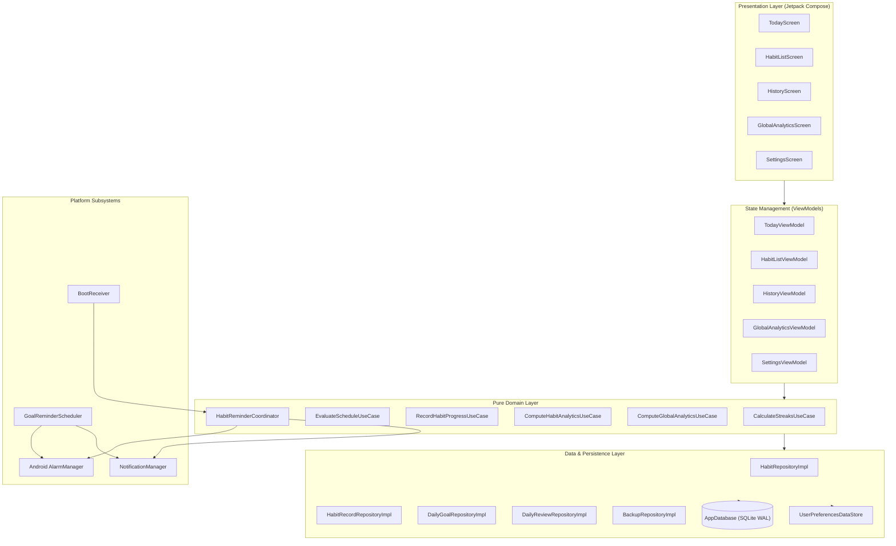

### Data Flow: Habit Completion Lifecycle

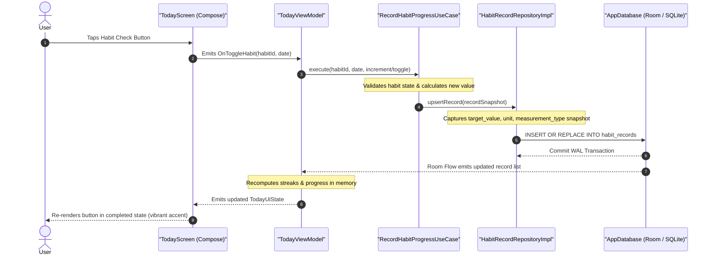

---

## 8. Data Model & Database Schema

The database is built on SQLite via AndroidX Room with Schema Version `4`. WAL mode is enabled for non-blocking concurrent reads and writes, and foreign key constraints are explicitly enforced on database open (`PRAGMA foreign_keys = ON;`).

### Database Entity Relationship Diagram

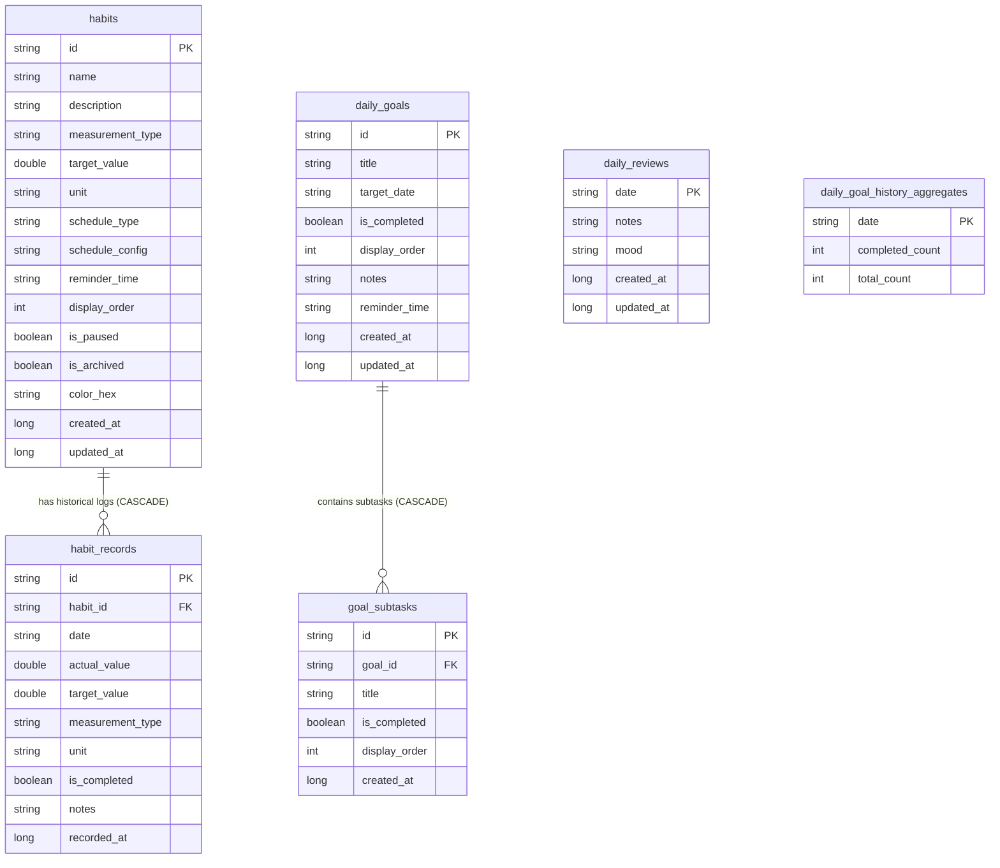

### Table Definitions & Invariants

1. **`habits`**: Authoritative habit definitions. Indexed on `[is_archived, display_order]` and `[created_at]`.
2. **`habit_records`**: Authoritative daily records. Enforces a composite unique index on `[habit_id, date]`, preventing duplicate entries on the same civil date. `target_value`, `measurement_type`, and `unit` are recorded as **immutable historical snapshots** at write time. Foreign key references `habits(id)` with `ON DELETE CASCADE`.
3. **`daily_goals`**: Outcomes planned for a specific civil date (`target_date`), with optional `reminder_time`. Indexed on `[target_date, display_order]` and `[created_at]`.
4. **`goal_subtasks`**: Granular tasks attached to a goal. Foreign key references `daily_goals(id)` with `ON DELETE CASCADE`. Indexed on `[goal_id, display_order]`.
5. **`daily_reviews`**: Subjective daily reflection and mood tag keyed by primary key `date` (`YYYY-MM-DD`).
6. **`daily_goal_history_aggregates`**: Preserves daily goal historical completion metrics (`completed_count` / `total_count`) keyed by `date`. Enforces domain invariants (`0 <= completed_count <= total_count`). Automatically updated during cleanup transactions (`cleanupCompletedGoalsBeforeDate`) so historical completion ratios remain accessible forever even when old individual goal rows are cleaned up.

---

## 9. Data Processing Lifecycle

Habit1 treats user data as structured, verifiable facts flowing through a strict lifecycle:

```
User Input
    │
    ▼
Validation (HabitValidator / GoalValidator / NumericInputValidator)
    │
    ▼
Domain Processing (EvaluateScheduleUseCase / RecordHabitProgressUseCase)
    │
    ▼
Persistence (Room Transaction / WAL Commit)
    │
    ▼
Reactive StateFlow Emission (Room Flow -> Repository -> ViewModel)
    │
    ▼
Derived Analytics & UI Recomposition (CalculateStreaksUseCase -> Jetpack Compose)
```

### Data Processing Matrix

| Data Type | Source | Processing / Validation | Storage Mechanism | Consumer / Purpose |
| :--- | :--- | :--- | :--- | :--- |
| **Habit Definition** | User creation / edit form | `HabitValidator`: non-blank name, positive target, valid schedule config | Room `habits` table | Today schedule evaluation & Habits list |
| **Habit Record** | User tap on Today / notification action | Snapshots `target_value`, `measurement_type`, `unit` at write time | Room `habit_records` table | History heatmaps, streak calculation, analytics |
| **Daily Goal** | User creation / dialog | `GoalValidator`: title length, valid ISO date, optional reminder | Room `daily_goals` table | Today daily goals list & History date inspection |
| **Goal Subtask** | User subtask entry | Parent foreign key validation, non-blank title | Room `goal_subtasks` table | Granular task tracking under daily goals |
| **Daily Review** | User optional reflection dialog | Optional mood tag string limit, note string limit | Room `daily_reviews` table | History day drill-down inspection |
| **Goal Aggregates** | Internal cleanup transaction | Computes `(completed_count, total_count)` before goal deletion | Room `daily_goal_history_aggregates` | Long-term history retention |
| **Preferences** | User settings toggle | DataStore transactional protobuf commit | AndroidX DataStore Preferences | App theme & notification toggles |
| **Backups** | User explicit export request | Canonical JSON encoding + SHA-256 integrity calculation | User-selected file via SAF | Offline cold storage & data migration |

---

## 10. The Historical Truth Model

One of Habit1's core engineering tenets is **Historical Truth**:

> **Recorded historical facts are immutable snapshots of what actually occurred on a given civil date. Future modifications to habit settings must never silently alter or rewrite past accomplishments.**

### 1. Snapshotting vs Dynamic Lookup
When a user logs a habit completion on September 10, Habit1 records not just the date and value, but snapshots the habit's configuration at that exact moment:
* `target_value` (e.g., target was 5 km)
* `measurement_type` (e.g., `QUANTITY`)
* `unit` (e.g., `km`)

If the user later modifies the habit on September 20 to target 10 km, the September 10 historical record continues to show that the 5 km target was successfully achieved. It is **never** retroactively marked incomplete.

### 2. Missing Records vs Fabricated Records
* A missed habit is represented by the **absence** of a database record for that scheduled date.
* Habit1 never inserts synthetic "missed" rows into the database. Doing so would waste storage and bloat database tables over years of use. Instead, the domain engine dynamically projects scheduled dates and identifies unrecorded days at query time.

### 3. Historical Facts vs Projections

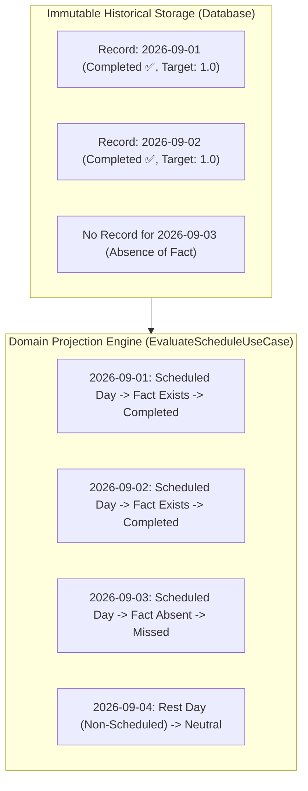

---

## 11. Analytics Pipeline & Mathematical Formulations

All analytics in Habit1 are deterministic, explainable, and derived directly from authoritative historical records without synthetic productivity scoring.

### 1. Streak Calculation Rules
1. **Scheduled Days Only**: Non-scheduled days (e.g., rest days in a 3-day/week schedule) neither advance nor break a streak.
2. **Current Streak Evaluation**: Evaluated stepping backwards from `todayDate`.
3. **Morning / Today Forgiveness**: If today is a scheduled day and has not yet been completed, it is considered *pending*. It does **not** prematurely reset an active streak from yesterday. If midnight passes without completion, tomorrow morning's calculation registers the missed day and resets the streak to 0.

### 2. Mathematical Formulas

$$\text{Current Streak} = \sum_{d \in \text{ScheduledDates}(\text{today} \to \text{past})} 1 \quad \text{until first missed past day}$$

$$\text{Longest Streak} = \max_{t} \left( \text{consecutive completed scheduled days} \right)$$

$$\text{Completion Rate} = \left( \frac{\text{Completed Scheduled Days}}{\text{Evaluated Scheduled Days}} \right) \times 100$$

*Note on Completion Rate*: If today is scheduled but not yet completed, the denominator excludes today (`scheduledDates.count { it < today }`) to avoid artificially depressing the user's completion rate early in the morning.

---

## 12. Privacy & Data Ownership

Habit1 is designed around absolute data containment:

```
┌────────────────────────────────────────────────────────┐
│               Android Application Sandbox              │
│                                                        │
│   ┌────────────────────┐      ┌────────────────────┐   │
│   │    Room SQLite     │      │     DataStore      │   │
│   │    (App-Private    │      │    Preferences     │   │
│   │   Sandbox Storage) │      │                    │   │
│   └─────────▲──────────┘      └────────────────────┘   │
│             │                                          │
│   ┌─────────▼──────────┐                               │
│   │   Backup System    │ ──(User SAF)──> Local Storage │
│   └────────────────────┘                 (External JSON│
│                                           File Picker) │
└────────────────────────────────────────────────────────┘
                       ╳
         android.permission.INTERNET
                 (OMITTED)
```

> **Data At Rest Security & Encryption Distinction**: Local data is contained entirely within the Android application private sandbox (`/data/data/com.habit1.app/`), protected by Android OS process isolation and physical hardware-backed File-Based Encryption (FBE) at the OS level. The database does not utilize custom SQLCipher database encryption. Exported JSON backups are unencrypted plain text; SHA-256 is utilized strictly for checksum integrity verification, not encryption.

### Data Storage & Privacy Matrix

| Data Category | Stored Locally | Transmitted Remotely | Storage Location / Mechanism | Purpose |
| :--- | :--- | :--- | :--- | :--- |
| **Habit Definitions** | Yes | **Never** | SQLite (`/data/data/com.habit1.app/databases/`) | Habit configuration & schedule |
| **Completion Records** | Yes | **Never** | SQLite (`habit_records` table) | Historical tracking & analytics |
| **Daily Goals & Subtasks** | Yes | **Never** | SQLite (`daily_goals`, `goal_subtasks`) | Daily planning & execution |
| **Daily Reviews & Mood** | Yes | **Never** | SQLite (`daily_reviews` table) | Personal qualitative reflection |
| **Goal Aggregates** | Yes | **Never** | SQLite (`daily_goal_history_aggregates`) | Long-term history retention |
| **App Preferences** | Yes | **Never** | DataStore (`habit1_preferences.preferences_pb`) | Theme & notification settings |
| **Exported Backups** | Yes | **Never** | User-selected file URI via SAF | Cold storage & data portability |
| **Network Requests** | **None** | **Never** | N/A (`INTERNET` permission absent) | Absolute privacy guarantee |

---

## 13. Security & Platform Model

Habit1 adheres to Android platform security best practices:

* **Android Application Sandbox**: App database files reside within the protected private internal storage directory (`/data/data/com.habit1.app/`). Other applications cannot access this data without root privileges.
* **Component Export Isolation**:
  * `AlarmReceiver`: `android:exported="false"`. Can only be invoked by internal explicit `PendingIntent`s from `AlarmManager`.
  * `HabitActionReceiver`: `android:exported="false"`. Can only be invoked by internal notification action intents.
  * `BootReceiver`: `android:exported="true"` with protected system intent-filters (`BOOT_COMPLETED`, `MY_PACKAGE_REPLACED`, `TIMEZONE_CHANGED`, `TIME_SET`).
* **Storage Access Framework (SAF)**: Export and import operations do not request broad `READ_EXTERNAL_STORAGE` or `MANAGE_EXTERNAL_STORAGE` permissions. Access is granted scoped solely to the specific document URI selected by the user.

---

## 14. Backup, Restore & Integrity Subsystem

The backup subsystem provides transparent user-controlled data portability without proprietary locks.

### Backup File Format (`BackupEnvelopeDto`)

Backups are exported as UTF-8 canonical JSON envelopes:

```json
{
  "formatVersion": 1,
  "appVersion": "1.0.0",
  "exportedAt": "2026-09-24T18:00:00Z",
  "checksum": "a3f5b2c9... (64-character SHA-256 hex string)",
  "payload": {
    "habits": [ ... ],
    "records": [ ... ],
    "goals": [ ... ],
    "subtasks": [ ... ],
    "reviews": [ ... ],
    "aggregates": [ ... ]
  }
}
```

### Checksum & Integrity Architecture

* **Canonicalization**: Prior to checksum calculation, JSON keys and entity lists are deterministically sorted (`BackupChecksumCalculator`).
* **SHA-256 Verification**: Payload integrity is validated using constant-time byte comparison (`MessageDigest.isEqual`), protecting against corrupted files or partial disk writes.
* **Integrity $\neq$ Encryption**: The SHA-256 checksum provides **tamper and corruption detection**, not confidentiality. The exported file is plain-text JSON. Users should store exported backups in secure private storage.

### Restore Modes

1. **Merge Mode**:
   * Non-destructive.
   * Compares `updatedAt` timestamps; newer definitions update existing habits.
   * **Preserves Local Historical Records**: If an existing local record conflicts with a backup record on `[habit_id, date]`, the local record is preserved to protect local historical truth.
2. **Replace All Mode**:
   * Pre-wipe alarm cancellation: Cancels all pending `AlarmManager` reminders to prevent phantom notifications.
   * Single Room Transaction: Deletes tables in child-to-parent order (`subtasks` $\to$ `goals` $\to$ `records` $\to$ `habits` $\to$ `reviews`), then inserts payload in parent-to-child order.
   * Transaction Rollback Safety: If any insertion fails, Room rolls back the database to its pre-restore state, and alarms are reconciled against the restored original state.
   * Post-Commit Alarm Synchronization: Platform reminders are rescheduled for all restored active habits.

---

## 15. Performance & Empirical Metrics

In accordance with project engineering standards, empirical benchmarks are strictly isolated from theoretical or unmeasured characteristics:

### Performance & Metrics Matrix

| Category | Metric | Value / Status | Verification Source & Method |
| :--- | :--- | :--- | :--- |
| **Measured Build** | Release APK Size | **1.71 MB** (1,796,282 bytes) | `app/build/outputs/apk/release/app-release.apk` (R8 minified, Proguard resource shrinking) |
| **Measured Build** | Debug APK Size | **17.59 MB** (18,445,575 bytes) | `app/build/outputs/apk/debug/app-debug.apk` (Unminified with Compose tooling preview) |
| **Measured Test** | Automated Unit Tests | **325 tests across 49 suites** | `./gradlew testDebugUnitTest` |
| **Measured Test** | Test Passing Rate | **100%** (325 passed, 0 failed, 0 skipped) | Gradle JUnit XML execution reports (`app/build/test-results/`) |
| **Measured Test** | Test Execution Duration | **~9.38 seconds** | Total test execution duration in JVM test executor |
| **Architectural Fact** | Database Journal Mode | **WAL (Write-Ahead Logging)** | Verified in `AppDatabase.kt` Room configuration |
| **Architectural Fact** | Persistent Background Jobs | **0 (Zero)** | WorkManager periodic jobs omitted; zero background services |
| **Unmeasured** | App Cold Startup Timing | *Not formally benchmarked* | Requires Android Macrobenchmark setup on dedicated hardware |
| **Unmeasured** | Frame Rendering / Jank % | *Not formally benchmarked* | Requires Macrobenchmark / JankStats profiling on physical device |

### Algorithmic Characteristics

* **Database Query Performance**: Composite indexes on `[habit_id, date]`, `[target_date, display_order]`, and `[is_archived, display_order]` guarantee $O(\log N)$ point queries and fast range scans.
* **Lexicographical Date Sorting**: Storing civil dates as ISO-8601 strings (`YYYY-MM-DD`) enables index-backed alphabetical range queries (`BETWEEN '2026-01-01' AND '2026-12-31'`) without timestamp conversion overhead.
* **In-Memory Analytics**: Analytics use cases operate over pre-filtered date ranges. Streak calculations execute in a single linear pass ($O(D)$ where $D$ is the count of scheduled dates in the evaluated period).

---

## 16. Testing Suite

The project includes an extensive test suite verifying business logic, database migrations, backup integrity, and ViewModel states.

```
       ┌───────────────────────────────┐
       │   Instrumented Device Tests   │
       │   Stage76PhysicalVerification │
       └───────────────▲───────────────┘
                       │
       ┌───────────────┴───────────────┐
       │     Integration & DB Tests    │
       │  RoomDatabaseTest, Repositories│
       │  BackupRoundtrip, Migrations  │
       └───────────────▲───────────────┘
                       │
       ┌───────────────┴───────────────┐
       │     Pure Domain Unit Tests    │
       │  Streaks, Schedules, Analytics│
       │  Validators, Checksums (325)  │
       └───────────────────────────────┘
```

### Verified Test Suites (49 Test Files, 325 Tests)

* **Domain & Business Logic**:
  * `CalculateStreaksUseCaseTest`: Leap years, year boundaries, pending today rules, and interval scheduling.
  * `EvaluateScheduleUseCaseTest`: Daily, specific days, and interval calculations anchored to historic dates.
  * `ComputeHabitAnalyticsUseCaseTest` & `ComputeGlobalAnalyticsUseCaseTest`: Range-based statistics and trend calculations.
  * `HabitValidatorTest` & `GoalValidatorTest`: Input constraints and domain invariant boundaries.
* **Database & Persistence**:
  * `RoomDatabaseTest`: In-memory SQLite verification, foreign-key cascades, and unique constraints.
  * `LongTermUsageDatabaseTest`: Performance and consistency under multi-year simulated record loads.
  * `RepositoryTest`: Reactive Flow emissions and dispatcher isolation.
* **Backup & Security**:
  * `BackupChecksumCalculatorTest`: Canonical JSON encoding and deterministic SHA-256 digests.
  * `BackupValidatorTest`: Schema version checks, orphan relationship detection, and string limit guards.
  * `BackupImporterMergeTest` & `BackupImporterReplaceAllTest`: Transactional integrity, rollback behavior, and conflict resolution.
  * `AdversarialRestoreIntegrityTest`: Resilience against malformed JSON, modified checksums, and corrupted records.
* **Presentation & ViewModels**:
  * `TodayViewModelTest`: Habit completion toggles, goal shifting, and midnight rollover.
  * `HabitFormViewModelTest`: Creation, validation, and editing workflows.
  * `HistoryViewModelTest` & `HabitHistoryViewModelTest`: Date drill-down and calendar range selections.

---

## 17. Action Semantics: Pause vs Archive vs Delete

Habit1 clearly delineates the operational consequences of habit lifecycle actions:

| Action | Future Scheduling | Historical Records | Visible on Today | Reversible | Typical Use Case |
| :--- | :--- | :--- | :--- | :--- | :--- |
| **Active** | Scheduled normally | Appended daily | Yes (when scheduled) | N/A | Ongoing habits being tracked. |
| **Pause** | Temporarily suspended | Fully preserved | No | **Yes** (one-tap unpause in Habits tab) | Vacations, injuries, or temporary breaks without breaking historical streak continuity. |
| **Archive** | Permanently halted | Fully preserved | No | **Yes** (unarchive from Habits tab under 'Archived') | Retired habits that you no longer practice but wish to retain in historical analytics. |
| **Delete** | Permanently removed | **Deleted (Cascade)** | No | **No** (Permanent) | Accidental habit creation or complete data purge. |

---

## 18. Build Requirements & Detailed Setup

### Environment Requirements
* **JDK**: Version 21 (`JavaVersion.VERSION_21`)
* **Android Studio**: Ladybug / Koala or newer recommended
* **Android SDK**: `compileSdk = 35`, `minSdk = 26`, `targetSdk = 35`
* **Gradle Wrapper**: 8.6+ (included as `gradlew` in repository)

### Step-by-Step Commands

```bash
# 1. Clone repository
git clone https://github.com/sathvikreddy369/habit.git
cd habit

# 2. Run automated unit tests (Robolectric & JVM)
./gradlew testDebugUnitTest

# 3. Run Android Lint static analysis
./gradlew lintDebug

# 4. Assemble Debug APK
./gradlew assembleDebug
# Output located at: app/build/outputs/apk/debug/app-debug.apk

# 5. Assemble Minified Release APK
./gradlew assembleRelease
# Output located at: app/build/outputs/apk/release/app-release.apk
```

### Installing via ADB

To install directly onto a connected physical Android device or emulator:

```bash
adb install -r apks/Habit1-latest-release.apk
```

---

## 19. Practical User Guide

### 1. Creating Your First Habit
1. Navigate to the **Habits** tab and tap the **`+`** button (or tap **`+`** on Today).
2. Enter the habit name (e.g., *"Daily Reading"*).
3. Select a **Measurement Type**:
   * *Boolean*: Binary completion.
   * *Count*: Stepper repetitions (e.g., 8 glasses).
   * *Duration*: Target minutes (e.g., 30 min).
   * *Quantity*: Numeric target with custom units (e.g., 5.0 km).
4. Configure the **Schedule**:
   * *Daily*, *Specific Days of the Week*, or *Intervals (every N days)*.
5. Set an optional **Reminder Time** (e.g., `08:00 AM`).
6. Tap **Save Habit**.

### 2. Daily Execution (Today Screen)
* Tap the circular action button on any habit card to log completion.
* For counter or quantity habits, tap `+` / `-` stepper buttons or tap the value to input numbers directly.
* Completed items transition to a vibrant checkmark; uncompleted items display a subtle slate indicator.

### 3. Managing Daily Goals
* Tap **`+ Add Goal`** under the Daily Goals section.
* Enter the goal title, optional notes, optional reminder time, and optional subtasks.
* Tap the goal check button to mark it done.
* If a goal is not finished today, open its menu and select **Move to Tomorrow**. An immediate snackbar offers a one-tap undo if shifted by mistake. In the History screen, goals on tomorrow can also be shifted back to today.

### 4. Viewing History & Analytics
* Open the **History** tab to inspect the monthly calendar heatmap.
* Toggle to the **Year** view for an annual consistency matrix.
* Tap any past calendar date to view the exact completed habits, goals, and daily reflection logged on that date.
* Tap on any habit from the **Habits** tab to open its dedicated deep-dive view with streaks, completion trends, and frequency distributions.

### 5. Exporting & Restoring Backups
* Navigate to **Settings** (gear icon on Today) $\to$ **Backup & Restore**.
* Tap **Export Backup** to generate a canonical JSON file and save it to your preferred location using the Android Storage Access Framework.
* To restore, tap **Import Backup**, select your file, choose between **Merge** or **Replace All**, and confirm after inspecting the validation summary.

---

## 20. Release Management & Artifacts

All production release binaries are maintained in the root `/apks` directory:

```
habit1/
└── apks/
    ├── Habit1-latest-release.apk    # Synchronized latest verified production release build
    └── app-release.apk              # Canonical release artifact (1.71 MB, R8 minified)
```

### Build Types & Minification

* **Release Variant (`app-release.apk`)**:
  * Minification (`isMinifyEnabled = true`): R8 full-mode tree-shaking and dead-code elimination.
  * Resource Shrinking (`isShrinkResources = true`): Strips unused drawables, strings, and layouts.
  * Resulting Size: **`1.71 MB`** (`1,796,282 bytes`).
* **Debug Variant (`app-debug.apk`)**:
  * Unminified with debug symbols and Compose inspection tooling preview (`17.59 MB`).
  * Package namespace suffixed with `.debug`.

---

## 21. Versioning & Changelog

Habit1 follows [Semantic Versioning (SemVer 2.0.0)](https://semver.org/):

* **Version Name**: `1.0.0` (Defined in `app/build.gradle.kts`)
* **Version Code**: `1` (Monotonically increasing integer)
* **Detailed History**: All release milestones, phase completions, and technical additions are documented in [CHANGELOG.md](CHANGELOG.md).

---

## 22. Design & UX Philosophy

1. **Action-First Today Screen**: The primary screen is optimized for immediate logging and execution. Users never need to dig through submenus or configuration trees to log what they did today.
2. **Calm Visual Hierarchy**: Avoids flashy gamification, synthetic productivity scores, or aggressive guilt triggers when days are missed.
3. **Low Cognitive Load**: Interactive stepper controls (`+` / `-`) for counters and direct numeric entry dialogs for rapid logging without typing fatigue.
4. **Explicit System States**: Completed vs uncompleted states are unmistakable through high-contrast circular action surfaces.

---

## 23. Accessibility Considerations

* **Touch Target Sizing**: Primary action buttons (habit check circles, goal toggles) maintain a minimum touch target size of at least `46.dp` $\times$ `46.dp`.
* **Dynamic Contrast & Theme Support**: Colors in both dark and light modes are tailored to meet standard contrast ratios against their respective container surfaces.
* **Content Descriptions**: Interactive icon buttons provide descriptive accessibility content labels (e.g., `"Create Habit or Daily Goal"`, `"Settings and Data"`).
* **Formal Accessibility Audit Status**: While foundational accessibility practices are implemented, formal automated TalkBack and screen-magnification audits have not yet been executed.

---

## 24. Error Handling & Resilience

* **Input Validation**: `HabitValidator` and `GoalValidator` catch invalid names, empty identifiers, negative target numbers, and malformed dates prior to database submission.
* **Backup Schema Validation**: `BackupValidator` validates JSON structure, envelope format version, field string length bounds, foreign key relationships, and SHA-256 payload integrity before initiating restore operations.
* **Transactional Rollback Safety**: If any database write fails during a **Replace All** restore, Room automatically rolls back all table operations to their exact pre-restore state, and alarms are reconciled against the recovered database.
* **Exact Alarm Permission Fallback**: If `SCHEDULE_EXACT_ALARM` permission is denied by the user, `AlarmManagerHabitReminderScheduler` gracefully falls back to `setAndAllowWhileIdle` rather than crashing.

---

## 25. Permissions Breakdown

Every requested permission in `AndroidManifest.xml` is justified and minimal:

| Android Permission | Why It Is Needed | User Prompt Timing | Failure Behavior if Denied |
| :--- | :--- | :--- | :--- |
| `POST_NOTIFICATIONS` | Delivering time-of-day reminder notifications on Android 13+ (API 33+). | Requested upon enabling reminders or launching habit form. | Reminders do not display status bar alerts; app functionality remains 100% operational. |
| `SCHEDULE_EXACT_ALARM` | Scheduling precise time-of-day habit and goal reminders via `AlarmManager`. | Declared in manifest; granted by default on API 31-32, toggleable in system settings on API 33+. | Falls back to inexact alarms (`setAndAllowWhileIdle`); reminders may be deferred slightly by OS Doze mode. |
| `RECEIVE_BOOT_COMPLETED` | Rescheduling active reminder alarms after device restart. | Granted automatically at install time. | Pending alarms are not restored until the app is next opened by the user. |
| `INTERNET` | **OMITTED** | Never requested. | Physical architectural guarantee of zero remote transmissions. |

---

## 26. Troubleshooting Guide

### 1. JDK Version Mismatch
* **Symptom**: Build errors indicating unsupported class file versions or compiler incompatibilities.
* **Resolution**: Ensure your JAVA_HOME points to **JDK 21**. In Android Studio, navigate to *Settings* $\to$ *Build, Execution, Deployment* $\to$ *Build Tools* $\to$ *Gradle* and verify *Gradle JDK* is set to JDK 21.

### 2. Reminders Not Firing
* **Symptom**: Time passes without reminder notification appearing.
* **Resolution**:
  1. Confirm `POST_NOTIFICATIONS` permission is enabled in Android App Info.
  2. Verify battery optimization is not aggressively killing the app (disable "Unrestricted battery usage" in Android App Info for exact alarm timing on certain OEM skins).
  3. Ensure the habit is neither paused nor archived.

### 3. Backup Import Fails Checksum Validation
* **Symptom**: Error message stating `"Checksum verification failed"`.
* **Resolution**: The backup file was edited manually or truncated during transfer. Ensure the backup JSON file has not been modified in a text editor that alters line endings or key ordering.

---

## 27. Frequently Asked Questions (FAQ)

### Does Habit1 require an account or internet connection?
No. Habit1 requires zero accounts, logins, or remote servers. The app does not request `android.permission.INTERNET` and works completely in airplane mode.

### Where is my data stored?
All application data is stored in a private SQLite database managed by AndroidX Room at `/data/data/com.habit1.app/databases/habit_app.db` on your device's internal storage.

### Does Habit1 sync between my devices?
There is no automatic cloud synchronization. To move your data to another device, export a backup from Settings and import it on the new device.

### What happens if I edit a habit's target value or measurement type?
Past achievements are preserved. Habit1 snapshots target values, measurement types, and units at the time of recording. Past completions are never retroactively recalculated or invalidated.

### What is the difference between Pause and Archive?
* **Pause**: Temporarily suspends future scheduling (e.g., during vacations or illness) without breaking historical streak calculations.
* **Archive**: Permanently hides retired habits from active tracking while retaining full history for annual analytics.

### Are exported backups encrypted?
No. Exported backup JSON files are plain text so that you own your data in a transparent, human-readable format. The SHA-256 checksum provides tamper and corruption detection, not encryption. Store backups in private, secure folders.

---

## 28. Current Limitations

* **Android Platform Only**: Habit1 is designed specifically for Android (API 26+) using Jetpack Compose and Room; there is no iOS, web, or desktop client.
* **Manual Data Portability**: Does not support real-time multi-device sync or background cloud backups.
* **Formal Macrobenchmarks Pending**: Automated cold-start and frame-render Macrobenchmark modules have not yet been established.
* **Formal Accessibility Audit Pending**: TalkBack screen-reader navigation and assistive touch audits have not yet been formally verified by automated testing.

---

## 29. Roadmap

Based on the verified status in [DEVELOPMENT_ROADMAP.md](DEVELOPMENT_ROADMAP.md):

### Completed Phases (Phases 1 – 10)
- [x] **Phase 1**: Infrastructure, Gradle Kotlin DSL, and manual dependency injection.
- [x] **Phase 2**: Room Database, WAL mode, migrations, and repository layer.
- [x] **Phase 3**: Pure Kotlin domain engine, streak evaluator, and schedule calculator.
- [x] **Phase 4**: Material 3 design system and core Today screen.
- [x] **Phase 5**: Habit management with 4 measurement models (Boolean, Count, Duration, Quantity).
- [x] **Phase 6**: Daily Goals, subtasks, independent completion, and date shifting with undo.
- [x] **Phase 7**: Monthly heatmap, yearly matrix, and individual habit history.
- [x] **Phase 8**: Battery-conscious AlarmManager reminders and boot recovery.
- [x] **Phase 9**: Canonical JSON backup, export, import, and SHA-256 verification.
- [x] **Phase 10**: Optional daily reflection/mood, hardening, and hardware test verification.

### Future Considerations
- [ ] Android 13+ App-specific language selection support.
- [ ] Dedicated Jetpack Macrobenchmark module for automated cold-start timing and frame-render tracking.
- [ ] Interactive home screen app widgets for rapid completion from the Android launcher.

---

## 30. Contributing & Standards

Contributions adhering to the project's engineering principles are welcome:

1. **Maintain Zero Network Surface**: Never introduce network permissions, remote analytics SDKs, or cloud dependencies.
2. **Preserve Historical Truth**: Never create synthetic missed rows or allow habit configuration changes to rewrite historical logs.
3. **Keep Tests Passing**: All PRs must pass the test suite:
   ```bash
   ./gradlew testDebugUnitTest lintDebug
   ```
4. **Measure Before Optimizing**: Do not introduce architectural complexity or premature optimizations without concrete profiling data.

---

## 31. Documentation Map

| Document | Location | Purpose |
| :--- | :--- | :--- |
| **README.md** | [README.md](README.md) | Central documentation, architecture, features, and setup guide. |
| **CHANGELOG.md** | [CHANGELOG.md](CHANGELOG.md) | Chronological release milestones and version history. |
| **PRODUCT_PRINCIPLES.md** | [PRODUCT_PRINCIPLES.md](PRODUCT_PRINCIPLES.md) | The 15 core architectural and product principles. |
| **ENGINEERING_RULES.md** | [ENGINEERING_RULES.md](ENGINEERING_RULES.md) | Technical constraints, coding standards, and architectural rules. |
| **DEVELOPMENT_ROADMAP.md** | [DEVELOPMENT_ROADMAP.md](DEVELOPMENT_ROADMAP.md) | Complete multi-phase architectural roadmap and ADR records. |
| **PHYSICAL_DEVICE_VERIFICATION.md** | [docs/PHYSICAL_DEVICE_VERIFICATION.md](docs/PHYSICAL_DEVICE_VERIFICATION.md) | Empirical hardware verification protocol on physical devices. |

---

## 32. License & Acknowledgements

Licensing information for this repository is not formally specified. All rights reserved by the author unless explicitly designated otherwise.

### Acknowledgements & Open Source Dependencies
* **AndroidX & Jetpack Compose**: Modern declarative UI toolkit by Google.
* **Room Persistence Library**: SQLite object-mapping abstraction by Google.
* **Kotlin Coroutines & Flow**: Structured asynchronous concurrency by JetBrains.
* **kotlinx.serialization**: Pure Kotlin reflection-free JSON serialization by JetBrains.
* **Robolectric & Turbine**: Industry-standard JVM testing frameworks.

---

## 33. TL;DR

* **What it is**: A private, offline habit tracker and daily goal application for Android (API 26+).
* **Core idea**: Decouple repeated habits from daily outcomes while treating user history as an immutable record of truth.
* **Tech Stack**: Kotlin 2.0.20, Jetpack Compose (BOM 2024.09.02), Room 2.6.1 (WAL SQLite), DataStore Preferences, kotlinx.serialization, platform AlarmManager.
* **Architecture**: Unidirectional Data Flow (UDF) with pure Kotlin domain use cases, reflection-free manual Dependency Injection (`AppContainer`), and sealed `Screen` navigation.
* **Data Storage**: Exclusively on-device SQLite database in the private Android app sandbox (`/data/data/com.habit1.app/databases/`).
* **Privacy Model**: Zero network permissions (`INTERNET` omitted), zero telemetry, zero analytics tracking, zero ads, zero accounts.
* **Key Engineering Concept**: **Historical Truth** — past accomplishments snapshot their configurations at write time and are never retroactively recalculated. Missed days are represented by the absence of a record, not fabricated rows.
* **Testing**: **325 automated unit tests across 49 test suites** (100% passing, 0 failures, 0 skipped, executed in `~9.38s`).
* **Performance**: **1.71 MB Release APK** (R8 minified), zero persistent background jobs.
* **Build Command**: `./gradlew assembleRelease`
* **Release Artifacts**: Pre-built release binaries maintained in `apks/` (`Habit1-latest-release.apk`, `app-release.apk`, 1.71 MB).
* **Current Limitations**: Android-only, manual backup transfer (no cloud sync), macrobenchmarks and formal TalkBack accessibility audits not yet formally automated.
* **Status**: Production Release v1.0.0 (Phases 1 through 10 completed and verified).
